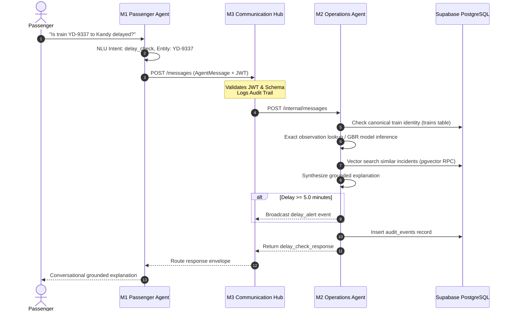

# 🚦 Module 2 (M2) — Operations & Delay-Prediction Agent
## Comprehensive Technical Documentation & Viva Defense Guide

> **Course**: IT3041 – Information Retrieval & Web Analytics (Year 3, Semester 2)  
> **Institution**: Sri Lanka Institute of Information Technology (SLIIT)  
> **Module**: M2 — Operations & Delay-Prediction Agent  
> **Role / Ownership**: Member B (Operations Agent Lead)  
> **Service Port**: `8005` | **Swagger API**: `http://localhost:8005/docs`  
> **Operations Control Room**: `http://localhost:8005/`  
> **Admin Operations Console**: `http://localhost:8005/admin`  
> **Also embedded in**: the unified portal at `http://localhost:3000/admin/operations`, and the passenger portal `http://localhost:3000/user` (delay popup + incident map)

---

## 📑 Table of Contents
1. [Executive Summary & Role in RailSense AI](#1-executive-summary--role-in-railsense-ai)
2. [What I Built (My Deliverables as Member B)](#2-what-i-built-my-deliverables-as-member-b)
3. [User-Side Functionalities (Passenger Experience)](#3-user-side-functionalities-passenger-experience)
4. [Admin-Side Functionalities (Control Room & Admin Console)](#4-admin-side-functionalities-control-room--admin-console)
5. [Verified Incident Map (Admin-Approved, Today Only)](#5-verified-incident-map-admin-approved-today-only)
6. [Operations Assistant (Role-Aware Tool-Calling Chatbot)](#6-operations-assistant-role-aware-tool-calling-chatbot)
7. [3D Banners & "Loco" the Train Robot](#7-3d-banners--loco-the-train-robot)
8. [Roles & Permissions (RBAC)](#8-roles--permissions-rbac)
9. [Inter-Agent Collaboration (How M2 Works with the Mesh)](#9-inter-agent-collaboration-how-m2-works-with-the-mesh)
10. [Deep-Dive: Machine Learning Delay Model](#10-deep-dive-machine-learning-delay-model)
11. [Deep-Dive: NLP (Incident Triage, Passenger Answers, Assistant)](#11-deep-dive-nlp-incident-triage-passenger-answers-assistant)
12. [Deep-Dive: Information Retrieval & Grounded RAG](#12-deep-dive-information-retrieval--grounded-rag)
13. [Graceful Degradation & Resilience Engineering](#13-graceful-degradation--resilience-engineering)
14. [Empirical Evaluation Benchmarks & Test Suite](#14-empirical-evaluation-benchmarks--test-suite)
15. [Setup, Configuration & Running](#15-setup-configuration--running)
16. [API Contracts & Endpoints](#16-api-contracts--endpoints)
17. [Project Structure](#17-project-structure)
18. [🎓 Viva Examination Q&A Defense Master](#18-viva-examination-qa-defense-master)

---

## 1. Executive Summary & Role in RailSense AI

The **Operations & Delay-Prediction Agent (M2)** is the operational intelligence core of the RailSense AI platform. While other agents handle conversational passenger intake (M1), ticket reservation (M3 Booking), and rolling-stock health (M4), **M2 is responsible for railway network situational awareness, delay forecasting, incident triage and approval, and grounded operational explanations** — for passengers, operations engineers and administrators alike.

```
                        PASSENGER INQUIRY (M1)            PASSENGER PORTAL (:3000/user)
                                  │                          │ Delay / Operations popup
                                  ▼                          │ Verified incident map
                        AGENT HUB ROUTER (M3)                │
                                  │  POST /internal/messages │
                                  ▼                          ▼
┌────────────────────────────────────────────────────────────────────────┐
│                   M2 OPERATIONS AGENT (Port 8005)                      │
│                                                                        │
│   1. Canonical Train Validation (Supabase 'trains' table)              │
│   2. Exact Historical Lookup -> ML Delay Regressor (GBR)               │
│   3. Vector IR / RAG Precedent Search (Supabase pgvector / TF-IDF)     │
│   4. Grounded Plain-Language Explanation Synthesis                     │
│   5. Passenger NLP answers (intent detection + template NLG)           │
│   6. Incident triage → admin approval → today's verified-incident map  │
│   7. Operations Assistant: role-aware Gemini tool calling, no guessing │
│   8. Auto-Alert Publishing (Delay >= 5.0m -> Hub & Redis)              │
│   9. Immutable Audit Trail (Supabase audit_events + local JSONL)       │
│                                                                        │
│   [ Operations Control Room UI ]     [ Admin Operations Console ]      │
│     3D delay-skyline banner            3D governance banner            │
└────────────────────────────────────────────────────────────────────────┘
```

M2 solves four critical railway problems:
1. **Eliminating Unexplained Delays**: Instead of telling a passenger "Train delayed 15 min", M2 provides a calculated delay grounded in real operational factors (e.g. *"Heavy rain near Kandy resulting in a 16.2 min precautionary speed restriction"*).
2. **Preventing AI Hallucinations**: Delays and causes are never invented by an LLM. Predictions come from a trained `GradientBoostingRegressor`, explanations are grounded in retrieved precedents, and the Operations Assistant may only phrase results returned by fixed data tools — with a number-check that rejects any figure not found in those results.
3. **Controlling What the Public Sees**: Staff-filed incidents stay private until an administrator approves them; only approved incidents, with an allowlisted set of fields, reach the public map — and only for the current day.
4. **Empowering Control Room Operators**: Live delay heatmaps, hourly delay pressure, incident management, model retraining with rollback, an audit trail, and an assistant that answers operational questions from live data.

---

## 2. What I Built (My Deliverables as Member B)

* **Machine Learning Pipeline (`ml/`)**
  * `train_delay_model.py`: training pipeline with one-hot feature encoding, held-out evaluation and model archiving.
  * `predict.py`: inference engine loading `delay_model.pkl` / `feature_importances.json`, hot-reloaded when the model file changes.
  * Exact historical-observation matcher that is preferred over regression when a train/route was actually observed.
* **Natural Language Processing (`nlp/`)**
  * Input sanitisation (`bleach` + Pydantic validators) against XSS / injection.
  * `classify_incident.py` and `summarize_incident.py`: incident classification and extractive summarisation.
  * `passenger_answer.py`: passenger question **intent detection** (delay, arrival, departure, location, reason, maintenance, incidents, stops, booking hand-off) and **template NLG** producing friendly, data-grounded answers.
* **Information Retrieval & Grounded RAG (`rag/`)**
  * `embed_documents.py`: `all-MiniLM-L6-v2` 384-d embeddings into Supabase `pgvector`.
  * `incident_retriever.py`: pgvector `match_incidents` RPC with offline TF-IDF cosine fallback.
  * `explanation.py`: grounded explanation synthesis from prediction + feature importances + precedents.
* **Incident Approval Workflow & Map (`incident_map.py`, `data/station_locations.json`)**
  * Admin-only Approve / Reject; a public, allowlisted, **today-only** map feed; one shared Leaflet map on three pages.
* **Operations Assistant (`ops_agent.py`, `ops_agent_tools.py`)**
  * Gemini function calling over seven fixed tools, filtered by role; fixed refusal messages; number-grounding guard; per-user history; audit logging.
* **Full-Stack Interfaces (`ui/`, `admin_ui/`, `ui/shared/`)**
  * **Operations Control Room (`ui/index.html`)** — 3D delay-skyline banner, consolidated dashboard, verified-incident map, delay prediction lab (route → train/station dropdowns), incident CRUD with station dropdown and searchable train picker.
  * **Admin Operations Console (`admin_ui/`)** — 3D governance banner, incident management with Approve/Reject and map, model retraining with rollback, read-only audit log, RBAC officer/role administration.
  * **Shared browser modules (`ui/shared/`)** — incident map, train picker, Operations Assistant widget, 3D stage and train robot, used by both consoles (and the map by the passenger portal).
* **Resilience & Storage Layer (`supabase_store.py`, `admin/admin_db.py`, `hub_client.py`)**
  * Dual persistence (Supabase PostgreSQL + pgvector online; CSV / TF-IDF / JSONL offline) and the Hub / Upstash alert publisher.
* **Automated tests (`tests/`)** — 32 pytest cases covering the approval workflow, map privacy, midnight cut-off, assistant grounding, role restrictions and history scoping.

---

## 3. User-Side Functionalities (Passenger Experience)

M2 powers the passenger intelligence delivered through the **User Portal** (`http://localhost:3000/user`) and the **M1 Passenger Chat**.

### 3.1 Conversational Delay Inquiries (via M1 → Hub → M2)
When a passenger asks M1 *"Is the 14:35 train from Colombo Fort to Kandy delayed?"*, M2:
1. **Validates the train** against the shared Supabase `trains` registry (`PM-4082`, bare service numbers such as `1005` are resolved too).
2. **Looks up an exact observation** in `operations_history` (e.g. `YD-9337` → 16.2 min, track-bed flooding near Kandy).
3. **Falls back to the ML model** (route, hour, day type, weather, station, incident type) when there is no exact record.
4. **Retrieves precedents** with the IR retriever and composes a grounded explanation.
5. Returns `predicted_delay_minutes`, `confidence`, `explanation`, `similar_past_incidents`, `model_version`.

### 3.2 "Delay" / "Operations" Popup on Today's Services
Each row of the passenger portal's *Today's services* board has **Delay** and **Operations** buttons. They open an animated popup (glassmorphism card that grows from the clicked button, rail progress track with the train's live position, delay gauge, word-by-word typed answers, suggestion chips, follow-up question box; closes on background click or Esc).

The popup calls **`POST /passenger/ask`** with the question and the clicked service's live context:

| Step | What happens |
|---|---|
| Intent detection | `nlp/passenger_answer.detect_intent()` classifies the question: delay, eta, departure, location, reason, maintenance, incidents, stops, greeting, status — or `handoff` for tickets/fares/refunds. Keyword rules first; a TF-IDF character n-gram classifier over labelled example questions handles typos ("wher is it", "dealyed?"). A named station ("when will it reach Kandy?") is extracted as an entity (exact, then fuzzy match). |
| Live journey | `live_tracker.compute_live()` builds a station-by-station timetable (intermediate times shared out by track distance between the published departure and arrival; the corridor's standard stations when the board lists no stops) and the train's position on the server's Asia/Colombo clock. Overnight runs are handled (a 19:15 → 04:30 train is "not yet departed" at 18:52). The board's own live fields are not trusted. |
| Map disruptions | Verified incidents from the live map that lie on the train's path (a stop, a corridor station, or within 4 km of the line) delay every stop after them, if the train reaches that point after the incident began. The delay is the median of the most similar past incidents retrieved (TF-IDF IR) for that incident's text, corridor and type; the answer names the cause and location. |
| Evidence | The board route is mapped to a model corridor; the delay comes from this train's recorded journeys or the delay model (no Hub alert); today's incident reports and, for "why" questions, retrieved precedents are added. |
| NLG | `compose_answer()` builds a headline, friendly paragraphs ("Instead of the scheduled 08:35, you can expect it at Kandy around 08:42"), fact tiles, a gauge and suggested follow-ups — every figure traced to data. |
| Hand-off | Booking/fare questions return `handoff: true` and the popup forwards them to the Passenger Assistant (`/api/chat`). |

### 3.3 Incidents on the Network (Passenger Map)
The home page shows a read-only map of incidents **approved by an administrator today** (see §5): type, station, train, a short summary and "verified 12 min ago". No internal fields and no admin controls.

### 3.4 Route Status
The gateway can query `GET /route-status/{route_id}` for a corridor's posture (`normal` / `watch` / `critical`), average delay and train count.

---

## 4. Admin-Side Functionalities (Control Room & Admin Console)

The operations surface was deliberately reduced from ~15 panels to **graded feature areas plus one consolidated dashboard**. Every figure shown is read from the real persistence layer — Supabase Postgres/pgvector when online, the local CSV / JSONL / TF-IDF stores when offline. **There are no hardcoded, mocked or randomly generated values.** When Supabase is unreachable each screen shows an explicit *"Offline mode — showing local data"* banner.

### Interface A: Operations Control Room (`http://localhost:8005/`)

```
┌──────────────────────────────────────────────────────────────────────────┐
│ RailSense AI — Operations Control Room          [SUPABASE LIVE] 17:04:22 │
├──────────────────────────────────────────────────────────────────────────┤
│ SCREEN 1 · NETWORK DASHBOARD                                             │
│ ┌─ 3D banner: Loco the train robot + corridor delay skyline + 24h ring ─┐│
│ [Network delay 8.4m] [On-time 43.8%] [Trips 2,999] [Audited 490]         │
│ ├ Delay pressure by hour (24h curve)  ├ Cause of delay (type-coloured)   │
│ ├ Route delay heatmap (7 corridors)   ├ Verified incident map (today)    │
│ └ Model evidence (R², MAE, RMSE)      └ NLP & retrieval evidence         │
├──────────────────────────────────────────────────────────────────────────┤
│ SCREEN 2 · DELAY PREDICTION & RAG EXPLANATION                            │
│ Route ▾ → Train ID ▾ / Station ▾ ──POST /predict-delay──▶ prediction,    │
│   confidence, grounded explanation, similar incidents, feature chart     │
├──────────────────────────────────────────────────────────────────────────┤
│ SCREEN 3 · INCIDENT MANAGEMENT — create · read · update · delete         │
│   Report form: Station ▾ + searchable Train picker ("Podi Menike · 1005")│
└──────────────────────────────────────────────────────────────────────────┘
                                          ✦ Operations Assistant (floating)
```

**1. Network Dashboard.** One `GET /api/dashboard` aggregate feeds the KPIs, the 24-hour delay-pressure curve, the per-corridor heatmap, the incident mix and the committed ML / NLP / retrieval metrics. `data_source` drives the offline banner. The **verified incident map** sits beside the heatmap (§5), and the *Cause of delay* bars use the same per-type colours as the map markers.

**2. Delay Prediction & RAG Explanation.** The **Route** field is a dropdown; choosing a route fills the **Train ID** and **Station** dropdowns with that corridor's trains and stations in travel order, from `GET /api/route-options` (the same corpus the model was trained on; every train id exists in the shared registry). The form posts to `/predict-delay`:

&nbsp;&nbsp;&nbsp;&nbsp;`shared.train_repository` train check → exact historical match → `ml/predict.py` → `rag/incident_retriever.py` → `rag/explanation.py`

**3. Incident Management — full CRUD.**

| Operation | Route | Behaviour |
|---|---|---|
| **Create** | `POST /incident-report` *(contract unchanged)* | Sanitisation → classification → summarisation → `incident_reports` → embedded for RAG. The form's **Station** is a dropdown of mappable corpus stations and **Train** is a searchable picker over `GET /api/trains` (named services such as *Podi Menike · 1005* first, ranked by the chosen station; any train by id, name or route). |
| **Read** | `GET /incidents` | Paginated listing; filter by text, classification and status (incl. `verified`). |
| **Update** | `PATCH /incidents/{id}` | Correct classification/summary; re-indexed for retrieval. A correction to a *verified* incident takes it off the public map until it is re-approved. |
| **Delete** | `DELETE /incidents/{id}` | Removes the row and its embedding. |

### Interface B: Admin Operations Console (`http://localhost:8005/admin`)

* **Home** — 3D governance banner (§7) plus live stats: data source, incidents logged, audit events, model versions.
* **Incident Management** — the same CRUD, plus **Approve / Reject** buttons (administrators only) and the verified-incident map with an "unmapped" note for stations without coordinates.
* **Model Retraining with Rollback** — "Retrain Now" runs `ml/train_delay_model.py` on the current corpus, archives the outgoing model to `ml/model_versions/` with a metrics sidecar, refreshes feature importances, and hot-reloads the predictor. Rollback restores any archived version without a restart.
* **Audit & Agent Communication Log (read-only)** — `audit_events` with filters pushed down to Postgres; no update/delete routes exist (write verbs return 405).
* **Officers & Access / Roles & Permissions** — the RBAC layer (§8).
* **Operations Assistant** — floating ✦ button on every tab (§6).

### Panels removed in the consolidation

| Removed | Why | What was kept |
|---|---|---|
| Active Risk Zones & Level Crossing Monitors | Simulated data, outside graded scope | — (the `/api/operations` mock store was deleted) |
| Live Auto-Refreshing Event Feed | Duplicated the audit explorer | Events surface in `/api/dashboard` and the audit log |
| Data Management (CSV import/export) | Not a graded item | `data/import_to_supabase.py`, `data/generate_dataset.py` and training remain CLI-runnable |
| Hub & Upstash Control | Diagnostics | `hub_client.py` alert publishing untouched; health is available to admins through the Operations Assistant |
| System Health & Config | Diagnostics | `GET /admin/api/health/status` remains (topbar pills, offline banners) |
| Simulated Live Map, Alert Dispatch, Analytics | Simulated entity data | Replaced by the **real** verified-incident map (§5) |

---

## 5. Verified Incident Map (Admin-Approved, Today Only)

Approved incidents appear as markers on a map in **three places**: the Control Room dashboard (beside the Route Delay Heatmap), the Admin Console's Incident Management screen, and the passenger home page on `:3000/user`.

```
 staff files incident ──► review_status = pending      (never on any map)
                               │
            admin clicks Approve (m2.incidents.review)   admin clicks Reject
                               │                               │
                               ▼                               ▼
      review_status = verified, verified_at = now       review_status = rejected
                               │                          (never on any map)
                               ▼
     GET /api/incidents/map-feed  ── only verified, only today, allowlisted fields
                               │   (polled every 5 s by all three maps)
                               ▼
      Control Room map · Admin Console map · Passenger map
```

| Piece | Detail |
|---|---|
| Approval | `POST /incidents/{id}/approve` → `verified` + `verified_at`; `POST /incidents/{id}/reject` → `rejected`. Both require capability `m2.incidents.review` (administrators). `PATCH` cannot set `verified`, and any later edit returns the incident to `corrected`. |
| Public feed | `GET /api/incidents/map-feed` returns only verified incidents with `id, train_id, station, lat, lon, incident_type, summary (≤180 chars), verified_at, status`. No `raw_text`, `nlp_method`, `reviewed_by` or audit ids ever leave the server. The browser also discards anything not marked `VERIFIED`. |
| Today only | The feed keeps incidents verified since **00:00 Sri Lanka time** (Asia/Colombo). The cut-off is recomputed on every request, so at midnight the previous day's markers disappear within one poll — including from the last-known copy served during an outage. |
| Coordinates | `data/station_locations.json`, keyed by the 17 stations of `operations_history.csv` (a test fails if one is missing). An approved incident at an unknown station is counted as `unmapped`, never placed at a guessed position. |
| Live updates | 5-second polling from one shared script; each poll replaces the marker set. Supabase Realtime was not used because it would stream whole rows, including internal fields, to the unauthenticated passenger page. |
| Front end | `ui/shared/incident-map.js` — Leaflet 1.9.4 (cdnjs) + keyless OpenStreetMap tiles (a CSS filter gives the dark version). One colour/icon per incident type, click popups with relative time, pulse on recent markers, legend and live/offline status pill. |
| Migration | `admin/incident_map_migration.sql` adds `verified_at`. Until applied, approvals still work and the feed falls back to `reviewed_at`. |

---

## 6. Operations Assistant (Role-Aware Tool-Calling Chatbot)

A gold ✦ button in the bottom-right of the **Control Room** and every **Admin Console** tab opens a chat panel with a **history rail** (the officer's own past questions, replayed read-only) and a conversation with example-question chips, stat chips and source citations. It appears only when `GET /api/ops-agent/capabilities` confirms the role holds `m2.assistant.use` (administrators and operations engineers).

### How an answer is produced
```
question ─► Gemini (GEMINI_MODEL) with ONLY the tools this role may use
              │
              ├─ calls data tools ─► backend runs them on real data ─► Gemini phrases the JSON
              │                                                         │
              │                                   number guard: every figure must exist in the
              │                                   tool results, else a code-built template answer
              │
              └─ calls a signal tool ─► fixed, properly worded message
                   report_restricted / report_insufficient / report_out_of_scope
```

| Tool | Wraps | Admin | Ops Engineer |
|---|---|---|---|
| `get_dashboard_kpis` | `/api/dashboard` | ✔ | ✔ |
| `get_route_status` | `/route-status` + corridor incident breakdown | ✔ | ✔ |
| `predict_delay` | `_compute_prediction` (same as `/predict-delay`, **no Hub alert**) | ✔ | ✔ |
| `get_incident_queue` | incident store (rejected incidents never returned) | ✔ | ✔ |
| `get_model_metrics` | evaluation artifacts + feature importances | ✔ | 🔒 |
| `get_audit_log` | `audit_events` | ✔ | 🔒 |
| `check_system_health` | Supabase / Hub / Upstash checks | ✔ | 🔒 |

### Every reply has an `answer_type`
| Type | When | Example |
|---|---|---|
| `answer` | Grounded answer | "Across **2,999** trips the network averages **8.4 min**…" + stat chips + citations |
| `restricted` 🔒 | An engineer asks about an admin topic | "🔒 **The audit log** is only available to administrators, so I can't share it with your Operations Engineer account…" |
| `insufficient_data` ℹ | Missing details, unknown route, a date the data can't be broken down by, or an action (officers, passwords, retraining, approving) | "…The operations data covers 2026-03-01 to 2026-09-27 as a whole and can't be broken down by a specific date or month." |
| `out_of_scope` ↪ | Not about railway operations | "That's outside what I can help with…" |
| `unavailable` ⚠ | The data source can't be reached | "I can't reach the live operations data right now, so I won't guess." |

**Safeguards:** free text the model writes without calling a tool is never shown; model-supplied reasons containing figures are dropped; highlights and citations are generated by code; without Gemini (or when it fails) a keyword router with the same role rules takes over. Every question is stored in `ops_agent_queries` (Supabase, local JSONL mirror) scoped to the officer's token identity, and written to `audit_events` with the role and answer type.

---

## 7. 3D Banners & "Loco" the Train Robot

Both consoles open with a live Three.js banner built from shared modules:

* **`ui/shared/train-robot.js` — "Loco"**: a locomotive-bodied robot (headlight, gold livery, cowcatcher, driver's-cab head with visor and blinking eyes, smokestack puffing steam, pantograph antenna, piston arms, wheeled bogie on a rail). Motions: rolls along its rail with spinning wheels, bobs and leans, head follows the mouse, and gestures **wave, point, nod, cheer, alert**.
* **`ui/shared/hero-deck.js`**: the shared stage — lights, holographic platform (rings, radar sweep, grid, dust), speech bubble that tracks Loco's head and types each line while he performs its gesture, floating labels, mouse parallax, pause when hidden, still frame in background tabs, reduced-motion and no-WebGL fallbacks.

| Banner | Scene | Loco says (live) |
|---|---|---|
| **Control Room** — "Keep every corridor running on time." | A **delay skyline**: one bar per corridor (height = average delay, colour = posture, labelled), a **24-hour delay-pressure ring** with the current hour pulsing | Points at the worst corridor, nods through the network average and on-time rate, points at the peak hour, alerts on today's incidents or cheers when there are none |
| **Admin Console** — "Govern the model, guard the network." | A gold **R² gauge** (arc = model R²), **pending-incident cards** orbiting it, green **approval beacons** for today, a rising **audit stream** | Greets the officer by name, points at pending work or cheers when the queue is clear, explains model accuracy, points at the audit stream |

All bars, cards, beacons, stats and speech come from `/api/dashboard`, the incident queue and the today-only map feed.

---

## 8. Roles & Permissions (RBAC)

Officers sign in with bcrypt-hashed passwords and receive signed, expiring JWTs. Permissions (`admin/admin_auth.py`) gate every route:

| Capability | Admin | Ops Engineer | Purpose |
|---|---|---|---|
| `m2.control_room.view` / `.action` | ✔ | ✔ | Control Room, dashboard, incidents |
| `m2.prediction.view` / `.run` | ✔ | ✔ | Delay prediction |
| `m2.assistant.use` | ✔ | ✔ | Operations Assistant |
| `m2.incidents.review` | ✔ | — | Approve / Reject incidents (publishes to the map) |
| `m2.model.manage` | ✔ | — | Retrain / rollback, model metrics |
| `m2.audit.view` | ✔ | — | Audit log |
| `m2.system.config` | ✔ | — | System health |
| `m2.officers.*` | ✔ | — | Officer & role administration |

Operations managers, dispatchers, analysts and viewers keep their existing subsets. `require_permission()` reads the standard `Authorization` header, and the last active administrator cannot be deactivated or demoted.

---

## 9. Inter-Agent Collaboration (How M2 Works with the Mesh)



1. **With M1 (Passenger Assistant)** — receives `delay_check` requests; answers booking hand-offs from the passenger popup are forwarded back to M1 via the gateway.
2. **With M3 (Communication Hub)** — registers at startup, receives `AgentMessage`s on `POST /internal/messages`, emits `delay_alert` for predictions ≥ 5.0 min (the Operations Assistant's predictions deliberately do **not** alert).
3. **With M3 (Booking Agent)** — both use the canonical Supabase `trains` table; the train picker and prediction dropdowns read it.
4. **With M4 (Maintenance Agent)** — out-of-service trains are reflected in the passenger popup ("This train isn't running right now").
5. **With the unified gateway (:3000)** — the portal embeds the Control Room and Admin Console; the passenger page loads M2's shared map script and calls `/passenger/ask` and `/api/incidents/map-feed` directly (CORS enabled, public data only).

---

## 10. Deep-Dive: Machine Learning Delay Model

### 10.1 Algorithm Selection: Gradient Boosting Regressor
**`GradientBoostingRegressor`** was selected after benchmarking against Linear Regression, Random Forest and Decision Trees. Railway delays exhibit non-linear interactions (heavy rain on a hill-country route at rush hour compounds far more than the same rain on a coastal route at noon); boosting's sequential residual correction captures these interactions while staying fast and interpretable.

### 10.2 Feature Engineering

| Feature Name | Type | Processing |
|---|---|---|
| `route` | Categorical | One-Hot Encoded (7 routes) |
| `station` | Categorical | One-Hot Encoded (major stations) |
| `scheduled_hour` | Continuous | Extracted from time (0–23) to capture peak vs off-peak |
| `weather` | Categorical | One-Hot Encoded (`clear`, `light_rain`, `heavy_rain`, `fog`, `extreme_heat`) |
| `day_type` | Categorical | One-Hot Encoded (`weekday`, `weekend`, `public_holiday`) |
| `incident_type` | Categorical | One-Hot Encoded (`none`, `signal_fault`, `mechanical`, `weather`, `track_obstruction`, `staffing`) |

### 10.3 Feature Importance Analysis
From `ml/feature_importances.json` (latest retrain against the live Supabase corpus):
1. **`incident_type_none` (0.7332)** — whether an incident occurred at all dominates.
2. **`incident_type_mechanical` (0.0769)**, **`incident_type_staffing` (0.0368)**, **`incident_type_track_obstruction` (0.0182)** — the largest delay spikes once an incident is present.
3. **`weather_clear` (0.0363)** and **`weather_heavy_rain` (0.0316)** — weather is the next strongest driver.
4. **`day_type_public_holiday` (0.0234)** and **`scheduled_hour` (0.0060)** — real but secondary effects.

Exact weights shift slightly between retrains; the dominance of `incident_type_none` is stable. The Admin Console's Model Operations screen always shows the current file.

---

## 11. Deep-Dive: NLP (Incident Triage, Passenger Answers, Assistant)

### 11.1 Incident Triage
```
Raw Staff Input
      │
      ▼
[ Security Sanitization ] ──► Bleach & Pydantic strip HTML/XSS/control characters
      │
      ├───────────────────────────────┐
      ▼                               ▼
[ Incident Classification ]     [ Sentence Summarization ]
• Rule-based keyword matching   • Frequency-scored extractive ranking
• 6 operational classes         • Condenses logs to 1-2 sentence briefs
• Optional LLM zero-shot mode   • Optional LLM generation
      │                               │
      └───────────────┬───────────────┘
                      ▼
   Persisted as `pending` → admin review → (verified) public map
```
1. **Sanitisation** — HTML, scripts and control characters are rejected (HTTP 422).
2. **Classification (`nlp/classify_incident.py`)** — `mechanical`, `signal_fault`, `weather`, `track_obstruction`, `staffing`, `other`.
3. **Summarisation (`nlp/summarize_incident.py`)** — frequency-scored extractive summary.

### 11.2 Passenger Answers (`nlp/passenger_answer.py`)
* **Intent detection** — weighted keyword rules over ten intents plus a `handoff` intent for booking/fare/refund questions (which always wins, even in "refund for a late train"). Explicit departure verbs win the "what time" tie.
* **Station entity extraction + TF-IDF intent fallback** — see §3.2.
* **Template NLG** — delay levels (on time ≤ 2, minor ≤ 5, moderate ≤ 15, major), expected-arrival arithmetic, live-position sentences, confidence phrasing and cause phrasing ("signal problems", "crew availability") — deterministic, so every sentence traces to data.

### 11.3 Operations Assistant Language Layer
Gemini only chooses tools and phrases their JSON; refusals are chosen from three signal tools and worded by fixed templates (§6). A regex number guard compares every figure in the model's text with the tool results (allowing rounding and ratio → percentage), and the rule-based router provides the same behaviour offline.

---

## 12. Deep-Dive: Information Retrieval & Grounded RAG

### 12.1 Vector Embedding Pipeline
Each of the 3,000 operations incident notes is embedded with `sentence-transformers/all-MiniLM-L6-v2` into **384-dimensional** vectors; newly filed incidents are embedded on creation and removed on deletion.

### 12.2 Dual-Engine Retrieval (`rag/incident_retriever.py`)
* **Primary** — Supabase `pgvector` via the `match_incidents` RPC:
  ```sql
  SELECT id, route, station, incident_type, incident_note, delay_minutes,
         1 - (embedding <=> query_embedding) AS similarity
  FROM incident_embeddings
  WHERE 1 - (embedding <=> query_embedding) > match_threshold
  ORDER BY similarity DESC LIMIT match_count;
  ```
* **Fallback** — Scikit-Learn `TfidfVectorizer` cosine similarity over `data/operations_history.csv`.

### 12.3 Grounded Explanation Generator (`rag/explanation.py`)
Inputs: the ML delay, the top feature importances and the top-3 retrieved precedents — synthesised into a short paragraph without inventing details. The passenger popup reuses retrieval for "why might it be late?" questions.

---

## 13. Graceful Degradation & Resilience Engineering

**No single cloud dependency failure crashes the service:**

| Dependency | When Online | When Offline / Failed |
|---|---|---|
| **Supabase Database** | Reads operations history and incidents from PostgreSQL | Local `data/operations_history.csv` and `data/incident_reports.jsonl` |
| **pgvector Retrieval** | Semantic search via RPC | Local TF-IDF vectorizer |
| **Audit Persistence** | Supabase `audit_events` | `data/audit_log.jsonl` |
| **Agent Hub (:8002)** | Routes delay alerts | Alerts retained in memory; M2 continues |
| **Upstash Redis** | Publishes notifications | Skipped cleanly |
| **ML Model File** | `GradientBoostingRegressor` inference | Median historical delay from matching records |
| **Incident map feed** | Today's verified incidents from Supabase | Local incident mirror; if unreadable, last known feed with `stale: true` ("Offline · last known"), still cut at midnight |
| **Leaflet / map tiles (CDN)** | Interactive map | Plain list of verified incidents |
| **Shared train registry** | Train picker lists ~2,900 trains with names | Picker builds the list from the operations corpus; typed ids still accepted |
| **Gemini (Operations Assistant)** | Tool calling | Keyword router + templates with the same role rules |
| **`verified_at` / `ops_agent_queries` not migrated** | Stored in Supabase | `reviewed_at` fallback; history kept in `data/ops_agent_queries.jsonl` |
| **WebGL (3D banners)** | Animated Three.js scene | Static gradient panel; text, stats and buttons unaffected |

---

## 14. Empirical Evaluation Benchmarks & Test Suite

### 14.1 Delay Prediction Model (`ml/train_delay_model.py`)

| Corpus | Records | MAE (min) | RMSE (min) | $R^2$ |
|---|---|---|---|---|
| Local CSV (`data/operations_history.csv`) | 3,000 | **2.239** | **2.876** | **0.8716** |
| Supabase `operations_history` (live) | 2,999 | **2.315** | **2.934** | **0.8551** |

Both use an 80/20 split at `random_state=42`; the small gap comes from Supabase holding 2,999 of the CSV's 3,000 rows.

### 14.2 Incident NLP Classification (`nlp/evaluate_nlp.py`)
* **Templated dataset (400 records)**: **100.00%** accuracy (Macro F1 = 1.00).
* **Out-of-template paraphrase stress test (6 samples)**: **33.33%** — keyword matching generalises poorly to unstructured text, motivating the optional LLM classifier.

### 14.3 Incident RAG Retrieval (`evaluation/rag/evaluate_retrieval.py`)
On 150 held-out queries: **P@1 1.0000 · P@3 1.0000 · P@5 0.9987**.

### 14.4 Automated Tests (`tests/`)
`python -m pytest M2-operations-agent/tests -q` → **40 passed** (32 test functions, some parametrised). Tests use in-memory stores and fake LLMs, so they are deterministic and never write to Supabase.

| File | Covers |
|---|---|
| `test_incident_map.py` | Corpus stations all have coordinates; only `verified` rows are public; pending/rejected never mapped; Approve/Reject need admin (401/403); allowlisted fields only; unknown stations counted not guessed; edits un-verify; `PATCH` cannot set `verified`; outage serves last known; **midnight cut-off**, including during an outage |
| `test_ops_agent.py` | Role access (401/403/200); per-role capabilities; grounded + cited answers; hallucinated numbers rejected; tool-less free text never shown; rejected incidents never cited; engineer restrictions for audit/health/model; forbidden tools never execute; missing-details, action and unknown-route replies; out-of-scope; offline "unavailable"; per-user private history; number guard |

---

## 15. Setup, Configuration & Running

### 15.1 Install
```powershell
python -m pip install -r M2-operations-agent/requirements.txt
```
(`fastapi`, `uvicorn`, `pandas`, `scikit-learn`, `sentence-transformers`, `supabase`, `bleach`, `slowapi`, `pyjwt`, `bcrypt`, `python-dotenv`, `google-generativeai`, `pytest`, …)

### 15.2 Environment (repository-root `.env`)
```dotenv
SUPABASE_URL=https://your-project.supabase.co
SUPABASE_SECRET_KEY=your-server-side-key
JWT_SECRET_KEY=replace-with-a-long-random-secret
GEMINI_API_KEY=your-gemini-key          # Operations Assistant (optional: falls back to rules)
GEMINI_MODEL=gemini-3.5-flash-lite
HUB_BASE_URL=http://localhost:8002      # default if unset
UPSTASH_REDIS_URL=...                   # optional
UPSTASH_REDIS_TOKEN=...                 # optional
```

### 15.3 Database migrations (Supabase SQL editor, safe to re-run)
| File | Adds |
|---|---|
| `supabase_phase5_schema.sql`, `admin/admin_schema.sql`, `admin/officers_schema.sql` | Operations history, embeddings, audit, incidents, officers |
| `admin/incident_map_migration.sql` | `incident_reports.verified_at` + index |
| `admin/ops_agent_migration.sql` | `ops_agent_queries` (per-officer assistant history, with `answer_type`) |

M2 runs before these are applied — see the fallbacks in §13.

### 15.4 Run
```powershell
cd M2-operations-agent
python -m uvicorn main:app --host 127.0.0.1 --port 8005 --reload
```
Open `http://localhost:8005/` (Control Room) and `http://localhost:8005/admin` (Admin Console), or `.\start_all.ps1` from the repository root to start every agent and the portals.

### 15.5 Test and evaluate
```powershell
python -m pytest M2-operations-agent/tests -q
python M2-operations-agent/ml/train_delay_model.py
python M2-operations-agent/nlp/evaluate_nlp.py
python M2-operations-agent/evaluation/rag/evaluate_retrieval.py
```

> **Browser caching:** M2 now sends `Cache-Control: no-cache` for `/`, `/admin/*` and `/shared/*`, so browsers revalidate UI files on every load. Copies cached **before** this header existed may need one hard refresh (Ctrl + F5).

---

## 16. API Contracts & Endpoints

### 16.1 Operations & passenger API

| Method | Path | Auth | Description |
|---|---|---|---|
| `GET` | `/health` | — | Liveness probe |
| `GET` | `/` · `/admin` | — | Control Room UI · Admin Console UI |
| `GET` | `/shared/*` | — | Shared browser modules (map, train picker, assistant, 3D stage, robot) |
| `GET` | `/api/dashboard` | — | Control-room aggregate: `overview`, `routes`, `hourly`, `incident_mix`, `feature_importance`, `ml_metrics`, `nlp_metrics`, `rag_metrics`, `events`, `data_source` |
| `GET` | `/api/route-options` | — | Route → ordered stations and train ids (prediction dropdowns) |
| `GET` | `/api/trains` | — | Train catalogue for the picker: `train_id`, `name`, `route`, `corridor_stations` (gzip-compressed) |
| `GET` | `/api/stations` | — | Corpus stations with coordinates |
| `POST` | `/predict-delay` | — | ML delay inference (+ Hub alert ≥ 5 min + audit). **In**: `route`, `train_id`, `station`, `weather`, `day_type`, `incident_type`, `scheduled_time` |
| `POST` | `/passenger/ask` | — | Passenger popup answer. **In**: `question`, `mode`, `service` (board context). **Out**: `intent`, `headline`, `paragraphs`, `facts`, `gauge`, `suggestions`, `sources`, `handoff` |
| `GET` | `/route-status/{id}` | — | Corridor posture, average delay, train count |
| `POST` | `/incident-report` | — | NLP incident triage *(contract unchanged)* |
| `GET` | `/incidents` | — | List incidents (`limit`, `offset`, `review_status`, `classified_type`, `search`) |
| `PATCH` | `/incidents/{id}` | — | Correct classification/summary (un-verifies) |
| `DELETE` | `/incidents/{id}` | — | Delete incident and its embedding |
| `POST` | `/incidents/{id}/approve` | `m2.incidents.review` | Verify → public map |
| `POST` | `/incidents/{id}/reject` | `m2.incidents.review` | Reject → never mapped |
| `GET` | `/api/incidents/map-feed` | — | Today's verified incidents, allowlisted fields; `day`, `since`, `stale`, `unmapped` |
| `GET` | `/api/ops-agent/capabilities` | `m2.assistant.use` | Role, tools, restricted topics, example questions |
| `POST` | `/api/ops-agent/ask` | `m2.assistant.use` | **In**: `question`. **Out**: `answer`, `answer_type`, `sources`, `highlights`, `tool_calls_made`, `answer_method` |
| `GET` | `/api/ops-agent/history` | `m2.assistant.use` | The officer's own past questions (newest first) |
| `POST` | `/internal/messages` · `/hub/message` | Hub JWT | Inbound Hub `delay_check` |

### 16.2 Admin console API (prefix `/admin/api`, JWT)

| Method | Path | Description |
|---|---|---|
| `POST` | `/login` · `/logout` · `GET /me` | Officer session; `/me` returns role and permissions |
| `GET` | `/health/status` | Supabase / Hub (`:8002` default) / Upstash liveness |
| `GET` | `/model/metrics` · `/model/metrics-history` · `/model/feature-importances` | Evaluation artifacts, run log, importances |
| `POST` | `/model/retrain` | Retrain, archive previous model, hot-reload |
| `GET` | `/model/versions` · `POST /model/rollback/{filename}` | Archived versions and rollback |
| `GET` | `/audit/events` · `/audit/summary` | **Read-only** audit trail and summary |
| — | `/officers/*`, `/roles/matrix` | RBAC administration |

---

## 17. Project Structure

```text
M2-operations-agent/
├── main.py                      FastAPI app: prediction, dashboard, incidents, map feed,
│                                passenger answers, train catalogue, Operations Assistant
├── incident_map.py              Verified-only, today-only, allowlisted map feed
├── ops_agent.py                 Assistant: roles, Gemini tool loop, signals, number guard, history
├── ops_agent_tools.py           The seven data tools (+ templates, citations, stat chips)
├── hub_client.py · supabase_store.py
├── admin/                       RBAC (admin_auth.py), stores (admin_db.py), admin API,
│                                SQL schemas and migrations
├── ml/                          train_delay_model.py, predict.py, delay_model.pkl, versions
├── nlp/                         classify_incident.py, summarize_incident.py, passenger_answer.py
├── rag/                         embed_documents.py, incident_retriever.py, explanation.py
├── data/                        operations_history.csv, station_locations.json,
│                                local JSONL mirrors (incidents, audit, assistant history)
├── evaluation/                  Committed ML / NLP / RAG metrics
├── ui/
│   ├── index.html               Operations Control Room
│   └── shared/                  incident-map.js · train-picker.js · ops-agent.js ·
│                                hero-deck.js · train-robot.js · hero.css
├── admin_ui/                    Admin Console (index.html, css/, js/views/)
└── tests/                       test_incident_map.py · test_ops_agent.py
```

---

## 18. 🎓 Viva Examination Q&A Defense Master

### Q1: "What was your specific contribution to RailSense AI?"
> "I designed and implemented **Module 2**: the Gradient Boosting delay regressor (MAE 2.24 min, $R^2$ 0.87 on 3,000 records), the NLP incident triage pipeline, the dual-engine IR/RAG system with 384-d embeddings in pgvector and TF-IDF fallback, grounded explanations, the incident approval workflow and today-only public map, the passenger delay popup's intent detection and NLG, a role-aware tool-calling Operations Assistant, and both operator consoles with live 3D banners — all integrated with M1 and the Hub."

### Q2: "Why Gradient Boosting over Linear Regression or Deep Learning?"
> "Delays come from non-linear feature interactions that linear models miss. Deep learning needs far more data, is slower and is a black box. Gradient boosting handles mixed tabular features, resists overfitting, infers in milliseconds, and exposes feature importances that feed the explanation layer."

### Q3: "How does your RAG pipeline prevent hallucinations in delay explanations?"
> "The number comes from the regressor or a historical record, the reasons are retrieved precedents, and the explanation layer only receives those facts as context — nothing else can enter the explanation."

### Q4: "What happens if Supabase or the Agent Hub goes down during your demo?"
> "M2 falls back to the local CSV, TF-IDF retrieval and JSONL audit; the map serves its last known feed marked 'Offline · last known'; the assistant says it can't reach live data instead of guessing. Both consoles stay usable."

### Q5: "What are the limitations of your NLP incident classifier?"
> "Keyword matching scores 100% on templated notes but 33% on paraphrased text. An optional zero-shot LLM classifier path exists to generalise to free-form reports."

### Q6: "How do you secure input in incident reports?"
> "Pydantic v2 validation, `bleach` sanitisation before NLP, SlowAPI rate limiting, and the passenger map's strict field allowlist so raw text never reaches the public."

### Q7: "How do you stop unapproved incidents from reaching passengers?"
> "Only `review_status = verified` rows pass `public_item()`, which copies an explicit allowlist. `verified` can only be set by the admin-only approve endpoint; edits reset it; rejected rows are never serialised. The browser also drops anything not marked `VERIFIED`, and each 5-second poll replaces the whole marker set, so a rejection disappears within one cycle. I avoided Supabase Realtime because it would have pushed whole rows, including internal fields, to an unauthenticated page."

### Q8: "Why does the map only show today's incidents, and how does midnight work?"
> "Operators and passengers care about current disruption. The server computes 00:00 Asia/Colombo on every request, so markers drop at midnight without a page refresh — even the last-known copy served during an outage is filtered. Tests simulate 23:59 vs 00:01 and a midnight outage."

### Q9: "Your assistant uses an LLM — how do you prove it doesn't make things up?"
> "The model can only call seven fixed data tools, filtered by the user's role. Its text is rejected unless every number appears in the tool results; text written without any tool call is never shown; refusals come from three signal tools and fixed wording; stat chips and citations are generated by code. Without Gemini, a keyword router gives the same behaviour. Every question is audited."

### Q10: "How do different roles experience the assistant?"
> "Tools carry the same RBAC capability as the screens they mirror. Operations engineers can ask about KPIs, routes, predictions and the incident queue; asking about the audit log, system health, model metrics or officer management returns a clear 🔒 'administrator only' reply rather than an answer. Actions such as creating officers are explained as things the assistant can't do, for every role."

---

## 👨‍💻 Author & Academic Attribution
* **Module Lead**: Member B (Operations & Delay Prediction Lead)  
* **Course**: IT3041 – Information Retrieval & Web Analytics  
* **Institution**: Sri Lanka Institute of Information Technology (SLIIT)  
* **Project**: RailSense AI — Multi-Agent Railway Intelligence Ecosystem
