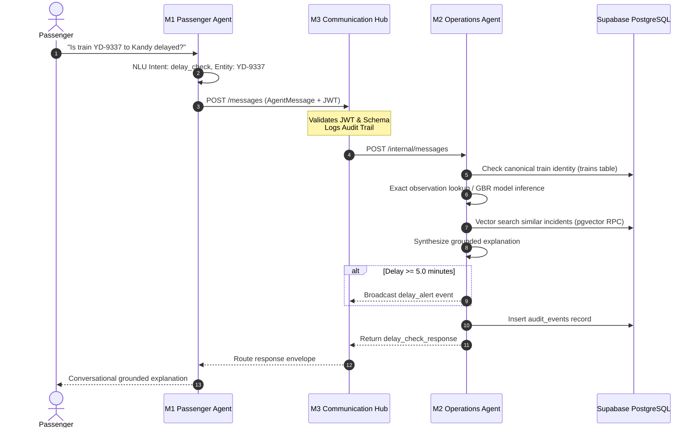

# 🚦 Module 2 (M2) — Operations & Delay-Prediction Agent
## Comprehensive Technical Documentation & Viva Defense Guide

> **Course**: IT3041 – Information Retrieval & Web Analytics (Year 3, Semester 2)  
> **Institution**: Sri Lanka Institute of Information Technology (SLIIT)  
> **Module**: M2 — Operations & Delay-Prediction Agent  
> **Role / Ownership**: Member B (Operations Agent Lead)  
> **Service Port**: `8005` | **Swagger API**: `http://localhost:8005/docs`  
> **Operations Control Room**: `http://localhost:8005/`  
> **Admin Operations Console**: `http://localhost:8005/admin`  

---

## 📑 Table of Contents
1. [Executive Summary & Role in RailSense AI](#1-executive-summary--role-in-railsense-ai)
2. [What I Built (My Deliverables as Member B)](#2-what-i-built-my-deliverables-as-member-b)
3. [User-Side Functionalities (Passenger Experience)](#3-user-side-functionalities-passenger-experience)
4. [Admin-Side Functionalities (Traffic Controller & Admin Experience)](#4-admin-side-functionalities-traffic-controller--admin-experience)
5. [Inter-Agent Collaboration (How M2 Works with the Mesh)](#5-inter-agent-collaboration-how-m2-works-with-the-mesh)
6. [Deep-Dive: Machine Learning Delay Model](#6-deep-dive-machine-learning-delay-model)
7. [Deep-Dive: NLP Incident Triage & Summarization](#7-deep-dive-nlp-incident-triage--summarization)
8. [Deep-Dive: Information Retrieval & Grounded RAG](#8-deep-dive-information-retrieval--grounded-rag)
9. [Graceful Degradation & Resilience Engineering](#9-graceful-degradation--resilience-engineering)
10. [Empirical Evaluation Benchmarks & Evidence](#10-empirical-evaluation-benchmarks--evidence)
11. [API Contracts & Endpoints](#11-api-contracts--endpoints)
12. [🎓 Viva Examination Q&A Defense Master](#12-viva-examination-qa-defense-master)

---

## 1. Executive Summary & Role in RailSense AI

The **Operations & Delay-Prediction Agent (M2)** is the operational intelligence core of the RailSense AI platform. While other agents handle conversational passenger intake (M1), ticket reservation (M3 Booking), and rolling-stock health (M4), **M2 is responsible for railway network situational awareness, real-time delay forecasting, incident triage, and grounded operational explanations.**

```
                        PASSENGER INQUIRY (M1)
                                  │
                                  ▼
                        AGENT HUB ROUTER (M3)
                                  │  POST /internal/messages (intent: delay_check)
                                  ▼
┌────────────────────────────────────────────────────────────────────────┐
│                   M2 OPERATIONS AGENT (Port 8005)                      │
│                                                                        │
│   1. Canonical Train Validation (Supabase 'trains' table)              │
│   2. Exact Historical Lookup -> ML Delay Regressor (GBR)               │
│   3. Vector IR / RAG Precedent Search (Supabase pgvector / TF-IDF)     │
│   4. Grounded Plain-Language Explanation Synthesis                     │
│   5. Auto-Alert Publishing (Delay >= 5.0m -> Hub & Redis)              │
│   6. Immutable Audit Trail (Supabase audit_events + local JSONL)       │
│                                                                        │
│   [ Operations Control Room UI ]     [ Admin Operations Console ]      │
└────────────────────────────────────────────────────────────────────────┘
```

M2 solves three critical railway problems:
1. **Eliminating Unexplained Delays**: Instead of telling a passenger "Train delayed 15 min", M2 provides a scientifically calculated delay grounded in real operational factors (e.g. *"Heavy rain near Kandy resulting in a 16.2 min precautionary speed restriction"*).
2. **Preventing AI Hallucinations**: Delays and causes are never invented by an LLM. Predictions stem from a trained `GradientBoostingRegressor`, and explanations are strictly grounded in retrieved historical precedents.
3. **Empowering Control Room Operators**: Provides dispatchers with live delay heatmaps, hourly congestion pressure graphs, incident categorization, automated triage, and model retraining controls.

---

## 2. What I Built (My Deliverables as Member B)

As the developer of **Module 2**, I engineered the following end-to-end components:

* **Machine Learning Pipeline (`ml/`)**:
  * `train_delay_model.py`: End-to-end training pipeline with One-Hot feature encoding and cross-validation.
  * `predict.py`: Real-time inference engine loading serialized artifacts (`delay_model.pkl`, `feature_importances.json`).
  * Real observation matcher prioritizing exact historical train records before general regression.
* **Natural Language Processing Pipeline (`nlp/`)**:
  * Input sanitization layer using `bleach` and Pydantic validators preventing XSS and injection attacks.
  * `classify_incident.py`: Incident classifier categorizing raw text into 5 operational classes.
  * `summarize_incident.py`: Extractive frequency-scored sentence summarizer generating 1–2 sentence operator briefs.
* **Information Retrieval (IR) & Grounded RAG (`rag/`)**:
  * `embed_documents.py`: Vector embedding pipeline utilizing `sentence-transformers/all-MiniLM-L6-v2`.
  * `incident_retriever.py`: Dual-backend retriever querying Supabase `pgvector` (`match_incidents` RPC) with local Scikit-Learn TF-IDF cosine similarity fallback.
  * `explanation.py`: Grounded explanation synthesizer combining numerical delay, top model feature importances, and retrieved incident citations.
* **Full-Stack Operations Interfaces (`ui/` & `admin_ui/`)**:
  * **Operations Control Room (`ui/index.html`)**: Three screens — a consolidated network dashboard, a delay prediction lab that shows the ML result together with its RAG-grounded explanation, and full incident CRUD.
  * **Admin Operations Console (`admin_ui/index.html`)**: Incident management, delay-model retraining with rollback, the read-only agent audit log, and the RBAC officer/role administration that gates them.
* **Resilience & Storage Layer (`supabase_store.py`, `hub_client.py`)**:
  * Dual-persistence architecture ensuring complete functionality online (Supabase PostgreSQL + pgvector) and offline (local CSV, TF-IDF, JSONL).
  * Outbound alert publisher broadcasting alerts to the Agent Hub and Upstash Redis.

---

## 3. User-Side Functionalities (Passenger Experience)

Although M2 is an operations microservice, it powers the passenger intelligence delivered through the **User Portal** (`http://localhost:3000/user`) and the **M1 Passenger Chat**:

### 1. Conversational Delay Inquiries
When a passenger in the chat asks:
> *"Is the 14:35 train from Colombo Fort to Kandy delayed?"*

M2 performs the following behind the scenes:
1. **Canonical Train Validation**: Resolves `PM-4082` / `YD-9337` against the shared Supabase `trains` registry.
2. **Exact Observation Retrieval**: Checks if this specific train on this route has a recorded observation in `operations_history`. For example, for train `YD-9337`, it discovers an exact recorded delay of **16.2 minutes** caused by track bed flooding near Kandy.
3. **ML Prediction Fallback**: If the train is not an exact historical record, M2 extracts the scheduled hour (14:00 = rush hour), route, day type, and weather, feeding them into the trained `GradientBoostingRegressor` to compute an expected delay.
4. **Historical Precedent Citations**: M2's IR retriever fetches similar historical incidents (e.g. *"Signal failure reported near Kandy, historical delay 9.4 min"*).
5. **Grounded Response Envelope**: Packages a comprehensive payload containing:
   * `predicted_delay_minutes`: 16.2
   * `confidence`: "high"
   * `explanation`: *"Historical observation for YD-9337: 16.2 minutes on Colombo Fort - Kandy. Recorded operational cause: Flooding risk reported on the track bed near Kandy, service ran at reduced speed as a precaution."*
   * `similar_past_incidents`: List of matching historical precedents.
   * `model_version`: "phase2-gbr-v1" or "historical-observation-v1"

### 2. Live Train Status Board on Web Portal
On the Passenger Portal (`/user`), users view real-time train board statuses. The gateway queries M2's `/route-status/{route_id}` endpoint, which calculates real-time route health (`normal`, `watch`, `critical`), average line delay, and active train count.

---

## 4. Admin-Side Functionalities (Traffic Controller & Admin Experience)

The operations surface was deliberately reduced from ~15 panels to **four graded feature
areas plus one consolidated dashboard**. Every panel that remains maps 1:1 to a rubric
item (ML, NLP, IR/RAG, agent-hub integration, auditability), and every figure it shows is
read from the real persistence layer — Supabase Postgres/pgvector when online, the local
CSV / JSONL / TF-IDF stores when offline. **There are no hardcoded, mocked, or randomly
generated values in any surviving screen.** When Supabase is unreachable each screen shows
an explicit *"Offline mode — showing local data"* banner rather than silently serving
stale or empty results.

### Interface A: Operations Control Room (`http://localhost:8005/`)

```
┌──────────────────────────────────────────────────────────────────────────┐
│ RailSense AI — Operations Control Room          [SUPABASE LIVE] 17:04:22 │
├──────────────────────────────────────────────────────────────────────────┤
│ SCREEN 1 · NETWORK DASHBOARD          (one /api/dashboard aggregate)      │
│ [Network delay 8.4m] [On-time 43.8%] [Trips 2,999] [Audited 330]         │
│ ├ Delay pressure by hour (24h curve)  ├ Cause of delay (incident mix)    │
│ ├ Route delay heatmap — 7 corridors, trips / avg / max / incident rate   │
│ └ Model evidence (R², MAE, RMSE)      └ NLP & retrieval evidence         │
├──────────────────────────────────────────────────────────────────────────┤
│ SCREEN 2 · DELAY PREDICTION & RAG EXPLANATION                            │
│ Request form ──POST /predict-delay──▶ prediction + confidence + version  │
│                                       grounded explanation               │
│                                       similar_past_incidents (real)      │
│                                       feature importances (real file)    │
├──────────────────────────────────────────────────────────────────────────┤
│ SCREEN 3 · INCIDENT MANAGEMENT — create · read · update · delete         │
└──────────────────────────────────────────────────────────────────────────┘
```

**1. Network Dashboard (consolidated).** What were three separate panels making three
separate calls — *Network KPI Overview*, *Route Delay Heatmap* and *Hourly Delay Pressure
Curve* — are now one section backed by a **single** `GET /api/dashboard` aggregate. It
reports network-wide mean delay, on-time rate, corpus size and audit volume; the 24-hour
delay-pressure curve (each bar annotated with its sample count); the per-corridor heatmap
with trips, mean delay, max delay and incident rate; the incident-type mix; and the
committed ML / NLP / retrieval evaluation metrics. The response carries a `data_source`
block (`{history, events, offline}`) that drives the offline banner.

**2. Delay Prediction & RAG Explanation (merged).** The old *Interactive Delay Simulation
Drawer* and the separate display of `similar_past_incidents` are now one screen, because
a prediction and the evidence it rests on should not be read in two places. The form posts
to the **existing** `/predict-delay` endpoint — no forked route. The backend chain is:

&nbsp;&nbsp;&nbsp;&nbsp;`shared.train_repository` train validity check →
exact historical match in `operations_history` →
else `ml/predict.py` against `delay_model.pkl` →
`rag/incident_retriever.py` (pgvector `match_incidents` RPC, TF-IDF fallback) →
`rag/explanation.py`

The screen renders `predicted_delay_minutes`, `confidence`, the grounded `explanation`,
the retrieved incidents with their real route / station / delay / similarity, the
`model_version`, and both the `retrieval_method` and `explanation_method` so the examiner
can see which path served the answer. The feature-importance chart reads
`ml/feature_importances.json` as written by the most recent training run.

**3. Incident Management — full CRUD (merged).** The *Incident Triage & Staff Briefing
Modal* (create) and the admin *Incident Review Queue* (review/reclassify) are now a single
screen:

| Operation | Route | Behaviour |
|---|---|---|
| **Create** | `POST /incident-report` *(contract unchanged)* | `bleach` + Pydantic sanitisation → `nlp/classify_incident.py` → `nlp/summarize_incident.py` → persisted to `incident_reports` → **fed to the embeddings pipeline** so RAG can cite it from then on |
| **Read** | `GET /incidents` | Paginated live listing with real `classified_type`, `summary`, `nlp_method`, `review_status` and timestamp; filter by text, classification and status |
| **Update** | `PATCH /incidents/{id}` | Controller corrects the classification or edits the summary; written back to the stored row **and** re-indexed for retrieval |
| **Delete** | `DELETE /incidents/{id}` | Removes the row **and** its `incident_embeddings` vector, so RAG never retrieves a ghost record |

`GET`/`PATCH`/`DELETE` are **additive** — the `POST /incident-report` request/response
shape that M1 and the Hub rely on is untouched.

### Interface B: Admin Operations Console (`http://localhost:8005/admin`)

**4. Model Retraining with Rollback.** "Retrain Now" runs `ml/train_delay_model.py`
against the **current** corpus — Supabase `operations_history` when reachable, the CSV
otherwise, never a cached sample. Before the new `delay_model.pkl` is written, the
outgoing model is archived to `ml/model_versions/delay_model_<unix_ts>.pkl` together with
a `.json` sidecar holding the metrics *that* model scored, so the rollback list shows real
filenames, real timestamps and real per-version metrics instead of placeholder text.
Retraining refreshes `feature_importances.json`, and `ml/predict.py` re-reads the model
whenever its mtime changes — **so both retrain and rollback take effect without a service
restart**. Rollback archives the current model first and restores the selected version's
metrics alongside it.

**5. Audit & Agent Communication Log (read-only).** Reads `audit_events` directly
(Supabase primary, `data/audit_log.jsonl` fallback). Every row is a genuinely logged event
carrying `message_id`, `sender_agent`, `receiver_agent`, `intent`, `timestamp` and
`outcome`. Search and filter by agent, intent and date range are **pushed down to
Postgres** when Supabase is reachable, so a large table is never pulled into the process
to be filtered in Python; the JSONL fallback applies the same predicates locally. The
screen is **tamper-evident by construction**: no update or delete route exists for
`audit_events`, and every write verb against it returns 405.

*Officers & Access* and *Roles & Permissions* also remain. They are not themselves graded
rubric items, but they are the RBAC layer that gates all four screens above, and the
unified gateway routes to them directly at `/admin/operations/admin/officers`.

### Panels removed in this consolidation

| Removed | Why | What was kept |
|---|---|---|
| Active Risk Zones & Level Crossing Monitors | Simulated data, outside graded scope | — (the backing `/api/operations` mock store was deleted outright) |
| Live Auto-Refreshing Event Feed | Duplicated the audit explorer | Events still surface in `/api/dashboard` and the audit log |
| Data Management (CSV import/export screen) | Not a graded rubric item | `data/import_to_supabase.py`, `data/generate_dataset.py` and the ML training pipeline remain fully runnable from the CLI |
| Hub & Upstash Control (connectivity probe) | Diagnostics, not a graded item | **All alert-publishing code in `hub_client.py` is untouched** — the ≥ 5.0-minute `delay_alert` broadcast still fires exactly as before |
| System Health & Config | Diagnostics screen | `GET /admin/api/health/status` remains — the offline banners and topbar pills read it |
| Live Map, Alert Dispatch, Operations Analytics | Simulated entity data | Real analytics folded into the consolidated dashboard |

### Verified incident map (real data, admin-approved only)

The simulated Live Map above was replaced by a map of **real incidents that an
administrator has verified**, shown in three places: the Control Room dashboard
(beside the Route Delay Heatmap), the Admin Console's Incident Management screen,
and the passenger home page on `:3000/user`.

| Piece | Where |
|---|---|
| Review workflow | `POST /incidents/{id}/approve` → `review_status = verified` + `verified_at`; `POST /incidents/{id}/reject` → `rejected`. Both need capability `m2.incidents.review` (administrators only). Any later edit (`PATCH`) drops the incident back to `corrected`, so changed text must be re-approved before it is public. |
| Public feed | `GET /api/incidents/map-feed` — verified rows only, allowlisted fields only (`id, train_id, station, lat, lon, incident_type, summary, verified_at, status`). No `raw_text`, `nlp_method`, `reviewed_by` or audit ids. |
| Coordinates | `data/station_locations.json`, keyed by the stations of `operations_history.csv` (a test fails if one is missing). The incident forms offer these stations as a dropdown; a verified incident at an unknown station is counted as `unmapped`, never placed at a guessed position. |
| Live updates | Every map polls the feed every 5 s (paused while the tab is hidden). Each poll replaces the marker set, so a rejected or re-edited incident disappears on the next cycle. Supabase Realtime was not used: it would stream whole rows, including internal fields, to the unauthenticated passenger page. |
| Front end | `ui/shared/incident-map.js`, served at `/shared/incident-map.js` and loaded by all three pages. Leaflet 1.9.4 (cdnjs) + keyless OpenStreetMap tiles. One colour per incident type, also used by the Control Room's "Cause of delay" chart. |
| Degradation | Store unreachable → last known feed with `stale: true` ("Offline · last known"). Leaflet unreachable → plain list of verified incidents. |
| Migration | `admin/incident_map_migration.sql` adds `verified_at`. Until it is applied, approvals still work and the feed uses `reviewed_at`. |
| Tests | `python -m pytest M2-operations-agent/tests/test_incident_map.py -q` |

### Operations Assistant (floating chatbot for admins and operations engineers)

A gold "spark" button in the bottom-right of the **Control Room** and every
**Admin Console** tab opens a chat panel (history rail + conversation). It is
shown only when `GET /api/ops-agent/capabilities` confirms the signed-in role
holds `m2.assistant.use` (administrators and operations engineers), and it is
removed on logout. It does not exist on the passenger pages.

| Piece | Where |
|---|---|
| Endpoints | `GET /api/ops-agent/capabilities`, `POST /api/ops-agent/ask`, `GET /api/ops-agent/history`, all behind `m2.assistant.use`. The officer id always comes from the signed token; a mismatching `session_user_id` / `user_id` gets 403. |
| Agent | `ops_agent.py`: Gemini function calling (`GEMINI_MODEL`) over a **fixed** tool set; the model only phrases tool results. |
| Tools and roles | `ops_agent_tools.py`. Each tool carries the RBAC capability of the screen it mirrors: dashboard KPIs, route status and the incident queue (`m2.control_room.view`), delay prediction (`m2.prediction.run`, no Hub alert) for both roles; model metrics (`m2.model.manage`), audit log (`m2.audit.view`) and system health (`m2.system.config`) for administrators only. The model is only offered the tools the role may use, and `_execute` refuses any other. |
| Clear refusals | Instead of improvising, the model calls `report_restricted`, `report_insufficient` or `report_out_of_scope`, and the backend answers with a fixed message. Every response has an `answer_type`: `answer`, `restricted` (admin-only topic asked by an engineer), `insufficient_data` (missing details, unknown route, a date the data can't be broken down by, or an action such as managing officers), `out_of_scope`, or `unavailable`. The widget shows these as labelled notices. |
| Grounding | Every number in a model answer must appear in the tool results, or the answer is replaced by a template built from the same results. Free text written without any tool call is never shown. Stat chips (`highlights`) and citation chips (`sources`) are generated by code. |
| Degradation | No Gemini / Gemini error: keyword router + templates, with the same role rules. Tool or data failure: "I can't reach the live operations data right now", never a guess. |
| Front end | `ui/shared/ops-agent.js` (styles included), loaded by `ui/index.html` and `admin_ui/index.html`. |
| History | `ops_agent_queries` (Supabase, `admin/ops_agent_migration.sql`) with a `data/ops_agent_queries.jsonl` mirror; per officer, newest first. Replaying a history item never re-queries. Every question also writes an `ops_agent_query` audit event with the role and answer type. |
| Tests | `python -m pytest M2-operations-agent/tests/test_ops_agent.py -q` |

---

## 5. Inter-Agent Collaboration (How M2 Works with the Mesh)

In RailSense AI, agents do not operate in silos. M2 collaborates across the entire ecosystem:



### Collaboration Summary by Agent:
1. **With M1 (Passenger Assistant)**:
   * M1 sends `delay_check` requests.
   * M2 validates station names against Sri Lankan rail routes to prevent hallucinated journeys.
   * M2 returns structured delay numbers, confidence ratings, and plain-language explanations that M1 presents conversationally.
2. **With M3 (Agent Communication Hub)**:
   * M2 registers its base URL at startup.
   * Receives all requests on `POST /internal/messages` wrapped in verified `AgentMessage` schemas.
   * If a predicted delay is $\ge 5.0$ minutes, M2 automatically emits a `delay_alert` message to the Hub.
3. **With M3 (Booking Agent)**:
   * Both agents reference the same canonical Supabase `trains` table.
   * If M2 flags high operational disruption or severe delays on a route, booking agents and passengers receive immediate visibility.
4. **With M4 (Maintenance Agent)**:
   * When M4 flags rolling stock as `OUT_OF_SERVICE` or under maintenance, route operations and delay risk assessments in M2 reflect rolling-stock constraints.
5. **With Supabase PostgreSQL & pgvector**:
   * Single source of truth for canonical train identities, 3,000 operations records, 384-dimensional vector embeddings, and audit event logs.

---

## 6. Deep-Dive: Machine Learning Delay Model

### 1. Algorithm Selection: Gradient Boosting Regressor
I selected **`GradientBoostingRegressor` (Scikit-Learn)** after benchmarking against Linear Regression, Random Forest, and Decision Trees.
* **Why Gradient Boosting?** Railway delays exhibit non-linear interactions: heavy rain on a mountainous route (Colombo–Badulla) during evening rush hour causes exponential delays compared to the same rain on a flat coastal route at noon. Gradient boosting builds sequential trees that correct prior residual errors, perfectly capturing these multi-feature interactions.

### 2. Feature Engineering
The model transforms categorical and continuous operational variables into numerical representations:

| Feature Name | Type | Processing |
|---|---|---|
| `route` | Categorical | One-Hot Encoded (7 routes) |
| `station` | Categorical | One-Hot Encoded (major stations) |
| `scheduled_hour` | Continuous | Extracted from time (0–23) to capture peak vs off-peak |
| `weather` | Categorical | One-Hot Encoded (`clear`, `light_rain`, `heavy_rain`, `fog`, `extreme_heat`) |
| `day_type` | Categorical | One-Hot Encoded (`weekday`, `weekend`, `public_holiday`) |
| `incident_type` | Categorical | One-Hot Encoded (`none`, `signal_fault`, `mechanical`, `weather`, `track_obstruction`, `staffing`) |

### 3. Feature Importance Analysis
Extracted directly from the trained model (`ml/feature_importances.json`, as of the latest
committed retrain against the live Supabase corpus):
1. **`incident_type_none` (Importance: 0.7332)**: By far the dominant signal — whether an
   incident occurred at all separates on-time trips from delayed ones more than any other
   factor.
2. **`incident_type_mechanical` (0.0769)**, **`incident_type_staffing` (0.0368)** and
   **`incident_type_track_obstruction` (0.0182)**: Cause the highest magnitude delay spikes
   once an incident is present.
3. **`weather_clear` (0.0363)** and **`weather_heavy_rain` (0.0316)**: Weather state is the
   next strongest driver — heavy rain triggers precautionary speed restrictions on hill
   country routes.
4. **`day_type_public_holiday` (0.0234)** and **`scheduled_hour` (0.0060)**: Calendar and
   time-of-day effects are real but secondary once incident type and weather are accounted
   for.

Retraining is non-deterministic across runs (the corpus, the Supabase/CSV split, and which
rows are sampled into the held-out set all shift), so exact weights move slightly between
runs — the ranking of `incident_type_none` as the dominant feature is stable across every
retrain observed. The admin console's Model Operations screen always reflects whichever
values `ml/feature_importances.json` currently holds.

---

## 7. Deep-Dive: NLP Incident Triage & Summarization

When station masters submit free-text incident reports, M2 processes them through a secure, multi-stage NLP pipeline:

```
Raw Staff Input
      │
      ▼
[ Security Sanitization ] ──► Bleach & Pydantic strip HTML/XSS/control characters
      │
      ├───────────────────────────────┐
      ▼                               ▼
[ Incident Classification ]     [ Sentence Summarization ]
• Rule-based keyword matching   • Frequency-scored extractive ranking
• Categorizes into 5 classes    • Condenses logs to 1-2 sentence briefs
• Optional LLM zero-shot mode   • Optional Claude/Gemini generation
      │                               │
      └───────────────┬───────────────┘
                      ▼
        Persisted to Incident Queue & Audit
```

1. **Input Sanitization**: Text is filtered using `bleach` and Pydantic field validators. Any attempt to inject HTML tags, script tags, or control characters is rejected with an HTTP 422 error.
2. **Classification (`nlp/classify_incident.py`)**: Categorizes text into `mechanical`, `signal_fault`, `weather`, `track_obstruction`, `staffing`, or `other`.
3. **Summarization (`nlp/summarize_incident.py`)**: An extractive frequency-based sentence ranker strips stopwords, scores sentences by significant word frequencies, and selects the top 1–2 most informative sentences.

---

## 8. Deep-Dive: Information Retrieval & Grounded RAG

To explain predictions without LLM hallucinations, M2 incorporates a state-of-the-art Information Retrieval and Retrieval-Augmented Generation (RAG) architecture:

### 1. Vector Embedding Pipeline
* Each of the 3,000 operations incident notes was embedded using `sentence-transformers/all-MiniLM-L6-v2`.
* Produces dense **384-dimensional vector embeddings** capturing semantic similarity regardless of exact vocabulary.

### 2. Dual-Engine Retrieval (`rag/incident_retriever.py`)
* **Primary (Cloud)**: Queries Supabase `pgvector` using the custom stored procedure `match_incidents`:
  ```sql
  SELECT id, route, station, incident_type, incident_note, delay_minutes,
         1 - (embedding <=> query_embedding) AS similarity
  FROM incident_embeddings
  WHERE 1 - (embedding <=> query_embedding) > match_threshold
  ORDER BY similarity DESC LIMIT match_count;
  ```
* **Fallback (Offline)**: If internet or Supabase is unavailable, M2 automatically falls back to an offline Scikit-Learn `TfidfVectorizer` computing cosine similarity over `data/operations_history.csv`.

### 3. Grounded Explanation Generator (`rag/explanation.py`)
The explanation layer takes three strictly factual inputs:
1. The numerical delay output from the ML regressor.
2. The top contributing features from the model's feature importance weights.
3. The top 3 retrieved historical incident precedents.

It synthesizes these facts into a concise, plain-language paragraph without inventing details.

---

## 9. Graceful Degradation & Resilience Engineering

A core requirement of enterprise railway software is fault tolerance. M2 is engineered so that **no single cloud dependency failure will crash the service**:

| Dependency | When Online | When Offline / Failed (Graceful Degradation) |
|---|---|---|
| **Supabase Database** | Reads historical operations from PostgreSQL | Reads from local `data/operations_history.csv` |
| **pgvector Retrieval** | Executes semantic similarity search via RPC | Uses offline Scikit-Learn TF-IDF vectorizer |
| **Audit Persistence** | Writes to Supabase `audit_events` table | Appends locally to `data/audit_log.jsonl` |
| **Agent Hub** | Routes delay alerts to Hub on Port 8002 | Retains alerts in-memory and continues locally |
| **Upstash Redis** | Publishes real-time pub/sub notifications | Skips publishing cleanly without throwing exceptions |
| **ML Model File** | Runs `GradientBoostingRegressor` inference | Calculates median historical delay from matching records |

---

## 10. Empirical Evaluation Benchmarks & Evidence

All metrics reported below were computed from committed evaluation scripts and datasets.

### 1. Delay Prediction Model Performance (`ml/train_delay_model.py`)

Training now reads the **current** corpus — Supabase `operations_history` when reachable,
`data/operations_history.csv` otherwise — so the figures depend on which source served the
run. `data_source` is recorded in `delay_model_metrics.json` and shown in the admin console.

| Corpus | Records | MAE (min) | RMSE (min) | $R^2$ |
|---|---|---|---|---|
| Local CSV (`data/operations_history.csv`) | 3,000 | **2.239** | **2.876** | **0.8716** |
| Supabase `operations_history` (live) | 2,999 | **2.315** | **2.934** | **0.8551** |

Both are 80% train / 20% test at `random_state=42`. The small gap is **not** a regression:
Supabase currently holds 2,999 of the CSV's 3,000 rows, which shifts the split. The CSV
figures remain reproducible offline with `python M2-operations-agent/ml/train_delay_model.py`
when Supabase is unreachable.

### 2. Incident NLP Classification (`nlp/evaluate_nlp.py`)
* **Templated Dataset Accuracy (400 records)**: **100.00%** (Macro F1 = 1.00).
* **Out-of-Template Paraphrased Stress Test (6 samples)**: **33.33%** (2/6 correct).
  * *Viva Honesty Note*: This gap demonstrates that keyword matching works well on standard terminology, but motivates our optional LLM zero-shot classifier for unstructured field text.

### 3. Historical Incident RAG Retrieval (`evaluation/rag/evaluate_retrieval.py`)
* **Evaluated on 150 held-out incident queries**:
  * **Precision@1**: **1.0000**
  * **Precision@3**: **1.0000**
  * **Precision@5**: **0.9987**

---

## 11. API Contracts & Endpoints

| Method | Path | Description | Key Request / Response Parameters |
|---|---|---|---|
| `GET` | `/health` | Liveness probe | `{"service": "operations-agent", "status": "ok"}` |
| `GET` | `/` | Operations Control Room UI | Serves `ui/index.html` |
| `GET` | `/admin` | Admin Operations Console | Serves `admin_ui/index.html` |
| `GET` | `/api/dashboard` | Consolidated control-room aggregate | **Out**: `overview`, `routes`, `hourly`, `incident_mix`, `feature_importance`, `ml_metrics`, `nlp_metrics`, `rag_metrics`, `events`, `data_source` (drives the offline banner) |
| `POST` | `/predict-delay` | ML delay inference | **In**: `route`, `train_id`, `station`, `weather`, `scheduled_time`<br>**Out**: `predicted_delay_minutes`, `explanation`, `top_features`, `similar_past_incidents` |
| `GET` | `/route-status/{id}`| Real-time route health | **Out**: `status` (normal/watch/critical), `average_delay_minutes`, `active_trains` |
| `POST` | `/incident-report` | NLP incident triage *(contract unchanged)* | **In**: `raw_text`, `train_id`, `station`<br>**Out**: `incident_id`, `classified_type`, `summary`, `nlp_method`, `received_at` |
| `GET` | `/incidents` | List triaged incidents *(added)* | **In**: `limit`, `offset`, `review_status`, `classified_type`, `search`<br>**Out**: `rows`, `count`, `source`, `offline` |
| `PATCH` | `/incidents/{id}` | Correct a classification or summary *(added)* | **In**: `classified_type`, `summary`, `review_status`<br>**Out**: `incident`, `source`, `offline` |
| `DELETE` | `/incidents/{id}` | Delete an incident and its embedding *(added)* | **Out**: `deleted`, `embedding_removed`, `source`, `offline` |
| `POST` | `/internal/messages`| Inbound Hub routing | Accepts `AgentMessage` (`intent: delay_check`), returns `delay_check_response` |
| `POST` | `/hub/message` | Direct Hub message handler | Legacy alias for `/internal/messages` |

**Admin console API** (prefix `/admin/api`, all admin-only, JWT-authenticated):

| Method | Path | Description |
|---|---|---|
| `GET` | `/health/status` | Supabase / Hub / Upstash / Anthropic liveness — drives the offline banners |
| `GET` | `/model/metrics-history` | Current held-out metrics + the real retrain/rollback run log |
| `GET` | `/model/feature-importances` | `ml/feature_importances.json` as written by the last run |
| `POST` | `/model/retrain` | Runs `ml/train_delay_model.py`; archives the outgoing model, reloads the predictor |
| `GET` | `/model/versions` | Real backup files with per-version metrics sidecars |
| `POST` | `/model/rollback/{filename}` | Restores a prior `.pkl` and its metrics |
| `GET` | `/audit/events` | **Read-only** agent audit trail; filter by `agent`, `intent`, `date_from`, `date_to` |
| `GET` | `/audit/summary` | Intent / sender distribution over the trail |
| — | `/officers/*`, `/roles/matrix` | RBAC administration (gates every screen above) |

> **Removed with the panel consolidation:** `GET /api/operations` (+ its `POST`/`PATCH`/`DELETE`),
> `GET /api/events`, `/admin/api/data/*`, `/admin/api/hub/*`, `/admin/api/health/data-sources`,
> `/admin/api/health/config`, `/admin/api/incidents/queue`. None are consumed by M1, M3 or M4 —
> they existed solely to serve retired admin screens. The `hub_client.py` alert publisher is
> untouched.


---

## 12. 🎓 Viva Examination Q&A Defense Master

Use this section to prepare for examiner questions regarding Module 2:

### Q1: "What was your specific contribution to RailSense AI?"
> **Answer**: "I designed and implemented **Module 2 (Operations & Delay-Prediction Agent)**. My responsibilities included:
> 1. Training and evaluating the machine learning delay regressor using Gradient Boosting on 3,000 historical operations records (achieving an MAE of 2.24 minutes and an $R^2$ of 0.87).
> 2. Engineering the NLP incident triage pipeline that sanitizes text against XSS using Bleach, classifies incident types, and extracts executive summaries.
> 3. Developing the dual-engine IR/RAG system utilizing 384-dimensional `all-MiniLM-L6-v2` embeddings in Supabase `pgvector` with local TF-IDF fallback.
> 4. Synthesizing grounded, non-hallucinated delay explanations combining model feature importances and historical precedents.
> 5. Building both the live Operations Control Room dashboard and Admin Console, while establishing full inter-agent integration with M1 and the Central Hub."

### Q2: "Why did you choose Gradient Boosting over Linear Regression or Deep Learning?"
> **Answer**: "Railway delays are governed by complex non-linear feature interactions. For example, severe weather on a mountainous route during rush hour creates compounding delays that linear models cannot capture. 
> While Deep Learning (like neural networks) can model non-linearities, it requires massive datasets to avoid overfitting, has high inference latency, and acts as an uninterpretable black box. 
> `GradientBoostingRegressor` is ideal for tabular operational data: it handles mixed categorical and continuous features, resists overfitting through shrinkage and shallow trees, operates with sub-10ms inference latency, and natively exposes feature importance weights that feed directly into our grounded explanation layer."

### Q3: "How does your RAG pipeline prevent hallucinations in delay explanations?"
> **Answer**: "We enforce strict factual grounding:
> 1. The delay number is strictly generated by our trained ML regressor or historical database record—never invented by a language model.
> 2. The incident reasons are retrieved from verified historical precedents in Supabase `pgvector` using cosine similarity.
> 3. The explanation layer only receives the numerical prediction, the mathematical feature importances, and the retrieved incident citations as prompt context. The model is forbidden from introducing outside facts, guaranteeing verifiable citations for passengers."

### Q4: "What happens if Supabase or the Agent Hub goes down during your demo?"
> **Answer**: "M2 is built with full graceful degradation:
> - If Supabase is unreachable, M2 seamlessly falls back to reading `operations_history.csv` and switches from `pgvector` to local TF-IDF cosine similarity.
> - If the Agent Hub is offline, M2 records audit events to a local `audit_log.jsonl` file and stores live alerts in-memory.
> As a result, both the API and the Operations Control Room remain 100% functional offline."

### Q5: "What are the limitations of your NLP incident classifier and how can it be improved?"
> **Answer**: "Our default classifier is a deterministic rule-based keyword matcher. On our dataset's templated notes, it achieves 100% accuracy. However, in our honest paraphrased stress test on unstructured text, accuracy dropped to 33% because staff often describe incidents without standard keywords. 
> To address this, we implemented an optional zero-shot LLM classification path in `nlp/classify_incident.py` that can be toggled via Anthropic or Gemini API keys, providing semantic generalization on free-form text."

### Q6: "How do you ensure security against malicious input in incident reports?"
> **Answer**: "We implement multi-tier defense:
> 1. Request-level validation using Pydantic v2 schemas enforcing string lengths and strict data types.
> 2. HTML and script sanitization using `bleach.clean()` to neutralize potential Cross-Site Scripting (XSS) or SQL injection payloads before text reaches the NLP pipeline.
> 3. Rate limiting via SlowAPI (120 requests/minute per IP) to mitigate Denial of Service (DoS) attempts."

---

## 👨‍💻 Author & Academic Attribution
* **Module Lead**: Member B (Operations & Delay Prediction Lead)  
* **Course**: IT3041 – Information Retrieval & Web Analytics  
* **Institution**: Sri Lanka Institute of Information Technology (SLIIT)  
* **Project**: RailSense AI — Multi-Agent Railway Intelligence Ecosystem
