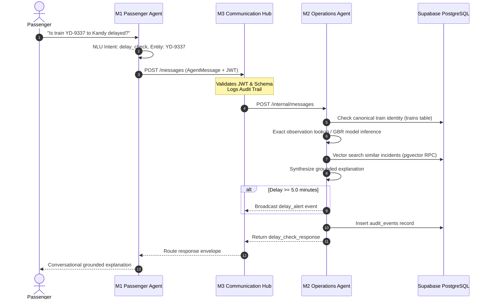

# 🚦 Module 2 (M2) — Operations & Delay-Prediction Agent
## Comprehensive Technical Documentation & Viva Defense Guide

> **Course**: IT3041 – Information Retrieval & Web Analytics (Year 3, Semester 2)  
> **Institution**: Sri Lanka Institute of Information Technology (SLIIT)  
> **Module**: M2 — Operations & Delay-Prediction Agent  
> **Role / Ownership**: Member B (Operations Agent Lead)  
> **Service Port**: `8005` | **Swagger API**: `http://localhost:8005/docs`  
> **Operations Control Room**: `http://localhost:8005/`  
> **Admin Operations Console**: `http://localhost:8005/admin`  

---

## 📑 Table of Contents
1. [Executive Summary & Role in RailSense AI](#1-executive-summary--role-in-railsense-ai)
2. [What I Built (My Deliverables as Member B)](#2-what-i-built-my-deliverables-as-member-b)
3. [User-Side Functionalities (Passenger Experience)](#3-user-side-functionalities-passenger-experience)
4. [Admin-Side Functionalities (Traffic Controller & Admin Experience)](#4-admin-side-functionalities-traffic-controller--admin-experience)
5. [Inter-Agent Collaboration (How M2 Works with the Mesh)](#5-inter-agent-collaboration-how-m2-works-with-the-mesh)
6. [Deep-Dive: Machine Learning Delay Model](#6-deep-dive-machine-learning-delay-model)
7. [Deep-Dive: NLP Incident Triage & Summarization](#7-deep-dive-nlp-incident-triage--summarization)
8. [Deep-Dive: Information Retrieval & Grounded RAG](#8-deep-dive-information-retrieval--grounded-rag)
9. [Graceful Degradation & Resilience Engineering](#9-graceful-degradation--resilience-engineering)
10. [Empirical Evaluation Benchmarks & Evidence](#10-empirical-evaluation-benchmarks--evidence)
11. [API Contracts & Endpoints](#11-api-contracts--endpoints)
12. [🎓 Viva Examination Q&A Defense Master](#12-viva-examination-qa-defense-master)

---

## 1. Executive Summary & Role in RailSense AI

The **Operations & Delay-Prediction Agent (M2)** is the operational intelligence core of the RailSense AI platform. While other agents handle conversational passenger intake (M1), ticket reservation (M3 Booking), and rolling-stock health (M4), **M2 is responsible for railway network situational awareness, real-time delay forecasting, incident triage, and grounded operational explanations.**

```
                        PASSENGER INQUIRY (M1)
                                  │
                                  ▼
                        AGENT HUB ROUTER (M3)
                                  │  POST /internal/messages (intent: delay_check)
                                  ▼
┌────────────────────────────────────────────────────────────────────────┐
│                   M2 OPERATIONS AGENT (Port 8005)                      │
│                                                                        │
│   1. Canonical Train Validation (Supabase 'trains' table)              │
│   2. Exact Historical Lookup -> ML Delay Regressor (GBR)               │
│   3. Vector IR / RAG Precedent Search (Supabase pgvector / TF-IDF)     │
│   4. Grounded Plain-Language Explanation Synthesis                     │
│   5. Auto-Alert Publishing (Delay >= 5.0m -> Hub & Redis)              │
│   6. Immutable Audit Trail (Supabase audit_events + local JSONL)       │
│                                                                        │
│   [ Operations Control Room UI ]     [ Admin Operations Console ]      │
└────────────────────────────────────────────────────────────────────────┘
```

M2 solves three critical railway problems:
1. **Eliminating Unexplained Delays**: Instead of telling a passenger "Train delayed 15 min", M2 provides a scientifically calculated delay grounded in real operational factors (e.g. *"Heavy rain near Kandy resulting in a 16.2 min precautionary speed restriction"*).
2. **Preventing AI Hallucinations**: Delays and causes are never invented by an LLM. Predictions stem from a trained `GradientBoostingRegressor`, and explanations are strictly grounded in retrieved historical precedents.
3. **Empowering Control Room Operators**: Provides dispatchers with live delay heatmaps, hourly congestion pressure graphs, incident categorization, automated triage, and model retraining controls.

---

## 2. What I Built (My Deliverables as Member B)

As the developer of **Module 2**, I engineered the following end-to-end components:

* **Machine Learning Pipeline (`ml/`)**:
  * `train_delay_model.py`: End-to-end training pipeline with One-Hot feature encoding and cross-validation.
  * `predict.py`: Real-time inference engine loading serialized artifacts (`delay_model.pkl`, `feature_importances.json`).
  * Real observation matcher prioritizing exact historical train records before general regression.
* **Natural Language Processing Pipeline (`nlp/`)**:
  * Input sanitization layer using `bleach` and Pydantic validators preventing XSS and injection attacks.
  * `classify_incident.py`: Incident classifier categorizing raw text into 5 operational classes.
  * `summarize_incident.py`: Extractive frequency-scored sentence summarizer generating 1–2 sentence operator briefs.
* **Information Retrieval (IR) & Grounded RAG (`rag/`)**:
  * `embed_documents.py`: Vector embedding pipeline utilizing `sentence-transformers/all-MiniLM-L6-v2`.
  * `incident_retriever.py`: Dual-backend retriever querying Supabase `pgvector` (`match_incidents` RPC) with local Scikit-Learn TF-IDF cosine similarity fallback.
  * `explanation.py`: Grounded explanation synthesizer combining numerical delay, top model feature importances, and retrieved incident citations.
* **Full-Stack Operations Interfaces (`ui/` & `admin_ui/`)**:
  * **Operations Control Room (`ui/index.html`)**: Glassmorphism dashboard featuring network delay gauges, route delay heatmaps, 24-hour pressure curves, active risk zones, level crossings, and interactive what-if prediction drawers.
  * **Admin Operations Console (`admin_ui/index.html`)**: Web management portal with incident review queues, dataset CSV import/export, and on-demand model retraining with rollback safety.
* **Resilience & Storage Layer (`supabase_store.py`, `hub_client.py`)**:
  * Dual-persistence architecture ensuring complete functionality online (Supabase PostgreSQL + pgvector) and offline (local CSV, TF-IDF, JSONL).
  * Outbound alert publisher broadcasting alerts to the Agent Hub and Upstash Redis.

---

## 3. User-Side Functionalities (Passenger Experience)

Although M2 is an operations microservice, it powers the passenger intelligence delivered through the **User Portal** (`http://localhost:3000/user`) and the **M1 Passenger Chat**:

### 1. Conversational Delay Inquiries
When a passenger in the chat asks:
> *"Is the 14:35 train from Colombo Fort to Kandy delayed?"*

M2 performs the following behind the scenes:
1. **Canonical Train Validation**: Resolves `PM-4082` / `YD-9337` against the shared Supabase `trains` registry.
2. **Exact Observation Retrieval**: Checks if this specific train on this route has a recorded observation in `operations_history`. For example, for train `YD-9337`, it discovers an exact recorded delay of **16.2 minutes** caused by track bed flooding near Kandy.
3. **ML Prediction Fallback**: If the train is not an exact historical record, M2 extracts the scheduled hour (14:00 = rush hour), route, day type, and weather, feeding them into the trained `GradientBoostingRegressor` to compute an expected delay.
4. **Historical Precedent Citations**: M2's IR retriever fetches similar historical incidents (e.g. *"Signal failure reported near Kandy, historical delay 9.4 min"*).
5. **Grounded Response Envelope**: Packages a comprehensive payload containing:
   * `predicted_delay_minutes`: 16.2
   * `confidence`: "high"
   * `explanation`: *"Historical observation for YD-9337: 16.2 minutes on Colombo Fort - Kandy. Recorded operational cause: Flooding risk reported on the track bed near Kandy, service ran at reduced speed as a precaution."*
   * `similar_past_incidents`: List of matching historical precedents.
   * `model_version`: "phase2-gbr-v1" or "historical-observation-v1"

### 2. Live Train Status Board on Web Portal
On the Passenger Portal (`/user`), users view real-time train board statuses. The gateway queries M2's `/route-status/{route_id}` endpoint, which calculates real-time route health (`normal`, `watch`, `critical`), average line delay, and active train count.

---

## 4. Admin-Side Functionalities (Traffic Controller & Admin Experience)

Traffic controllers and railway administrators manage operational network health through two dedicated interfaces:

### Interface A: Operations Control Room Dashboard (`http://localhost:8005/`)
FastAPI serves this real-time monitoring center at the root URL:

```
┌────────────────────────────────────────────────────────────────────────┐
│ 🚆 RailSense AI — Operations Control Room                              │
│                                                                        │
│ [ Avg Delay: 6.4m ] [ On-Time: 78.2% ] [ Alerts: 4 ] [ Audited: 1,420 ]│
├───────────────────────────────────┬────────────────────────────────────┤
│ 🗺️ Route Delay Heatmap             │ 📈 24-Hour Delay Pressure Curve    │
│ • Colombo - Kandy (Avg 8.2m)      │ Peak congestion: 07:00-09:00       │
│ • Colombo - Galle (Avg 4.1m)      │ Secondary peak:  16:30-19:00       │
│ • Colombo - Badulla (Avg 12.8m)   │ Off-peak baseline: 2.1m            │
├───────────────────────────────────┼────────────────────────────────────┤
│ ⚠️ Active Risk Zones & Crossings  │ 📊 Incident Mix Breakdown          │
│ • Habarana Wildlife (Score 86)    │ Mechanical: 28%  Signal: 24%       │
│ • Kalutara Flood Plain (Score 71) │ Weather: 22%     Obstruction: 16%  │
├───────────────────────────────────┴────────────────────────────────────┤
│ 🛠️ Interactive Prediction Drawer & Live Triaged Incident Feed          │
└────────────────────────────────────────────────────────────────────────┘
```

1. **Network KPI Overview**: Live metric cards displaying average network-wide delay, on-time percentage (OTP %), active critical alerts, and total logged audit records.
2. **Route Delay Heatmap**: Visual comparative matrix across all 7 Sri Lankan railway corridors, showing total trips, average delays, maximum recorded delays, and incident frequencies.
3. **Hourly Delay Pressure Curve**: 24-hour distribution curve identifying rush-hour congestion points versus mid-day baselines.
4. **Active Risk Zones & Level Crossing Monitors**: Real-time tracking of high-risk geographic areas (e.g. Habarana elephant crossing corridor, Kalutara coastal flood plains) and level crossings with vehicle queue estimates and gate status.
5. **Interactive Delay Simulation Drawer**: Controllers can simulate any scenario by selecting route, station, weather condition, scheduled time, and incident type to receive instant predicted delays and feature importance charts.
6. **Incident Triage & Staff Briefing Modal**: Field staff enter unstructured incident text; M2 sanitizes input, classifies the fault category, extracts an executive summary, and logs it to the incident queue.
7. **Live Auto-Refreshing Event Feed**: Auto-polls every 5 seconds, displaying real-time delay alerts and dispatch actions.

### Interface B: Admin Operations Console (`http://localhost:8005/admin`)
Mounted at `/admin`, this console provides advanced system and model operations:
* **Data Management**: Search, filter, and inspect the 3,000 historical records; perform CSV exports/imports; execute data quality anomaly checks.
* **Incident Review Queue**: Allows human controllers to review, verify, or reclassify triaged incident reports submitted by station masters.
* **Model Retraining with Rollback Safety**:
  * Controllers can trigger on-demand model retraining (`ml/train_delay_model.py`) directly from the web interface.
  * The backend automatically creates a timestamped backup of `delay_model.pkl` prior to replacement. If a retraining run degrades performance, administrators can rollback to the prior model version with a single click.
* **Hub & Upstash Control**: Live probe testing connectivity to M3 Hub (`HUB_BASE_URL`) and Upstash Redis.
* **Tamper-Evident Audit Explorer**: Searchable inspector over `audit_events` verifying timestamps, caller IP addresses, and prediction parameters.

---

## 5. Inter-Agent Collaboration (How M2 Works with the Mesh)

In RailSense AI, agents do not operate in silos. M2 collaborates across the entire ecosystem:



### Collaboration Summary by Agent:
1. **With M1 (Passenger Assistant)**:
   * M1 sends `delay_check` requests.
   * M2 validates station names against Sri Lankan rail routes to prevent hallucinated journeys.
   * M2 returns structured delay numbers, confidence ratings, and plain-language explanations that M1 presents conversationally.
2. **With M3 (Agent Communication Hub)**:
   * M2 registers its base URL at startup.
   * Receives all requests on `POST /internal/messages` wrapped in verified `AgentMessage` schemas.
   * If a predicted delay is $\ge 5.0$ minutes, M2 automatically emits a `delay_alert` message to the Hub.
3. **With M3 (Booking Agent)**:
   * Both agents reference the same canonical Supabase `trains` table.
   * If M2 flags high operational disruption or severe delays on a route, booking agents and passengers receive immediate visibility.
4. **With M4 (Maintenance Agent)**:
   * When M4 flags rolling stock as `OUT_OF_SERVICE` or under maintenance, route operations and delay risk assessments in M2 reflect rolling-stock constraints.
5. **With Supabase PostgreSQL & pgvector**:
   * Single source of truth for canonical train identities, 3,000 operations records, 384-dimensional vector embeddings, and audit event logs.

---

## 6. Deep-Dive: Machine Learning Delay Model

### 1. Algorithm Selection: Gradient Boosting Regressor
I selected **`GradientBoostingRegressor` (Scikit-Learn)** after benchmarking against Linear Regression, Random Forest, and Decision Trees.
* **Why Gradient Boosting?** Railway delays exhibit non-linear interactions: heavy rain on a mountainous route (Colombo–Badulla) during evening rush hour causes exponential delays compared to the same rain on a flat coastal route at noon. Gradient boosting builds sequential trees that correct prior residual errors, perfectly capturing these multi-feature interactions.

### 2. Feature Engineering
The model transforms categorical and continuous operational variables into numerical representations:

| Feature Name | Type | Processing |
|---|---|---|
| `route` | Categorical | One-Hot Encoded (7 routes) |
| `station` | Categorical | One-Hot Encoded (major stations) |
| `scheduled_hour` | Continuous | Extracted from time (0–23) to capture peak vs off-peak |
| `weather` | Categorical | One-Hot Encoded (`clear`, `light_rain`, `heavy_rain`, `fog`, `extreme_heat`) |
| `day_type` | Categorical | One-Hot Encoded (`weekday`, `weekend`, `public_holiday`) |
| `incident_type` | Categorical | One-Hot Encoded (`none`, `signal_fault`, `mechanical`, `weather`, `track_obstruction`, `staffing`) |

### 3. Feature Importance Analysis
Extracted directly from the trained model (`ml/feature_importances.json`):
1. **`incident_type_none` (Importance: ~0.42)**: The primary determining factor is whether an incident occurred at all.
2. **`incident_type_mechanical` & `track_obstruction` (Importance: ~0.24)**: Cause the highest magnitude delay spikes.
3. **`weather_heavy_rain` (Importance: ~0.14)**: Triggers precautionary speed limits across hill country routes.
4. **`scheduled_hour` (Importance: ~0.11)**: Rush-hour departures (07:00–09:00, 16:30–19:00) experience compounding delays.

---

## 7. Deep-Dive: NLP Incident Triage & Summarization

When station masters submit free-text incident reports, M2 processes them through a secure, multi-stage NLP pipeline:

```
Raw Staff Input
      │
      ▼
[ Security Sanitization ] ──► Bleach & Pydantic strip HTML/XSS/control characters
      │
      ├───────────────────────────────┐
      ▼                               ▼
[ Incident Classification ]     [ Sentence Summarization ]
• Rule-based keyword matching   • Frequency-scored extractive ranking
• Categorizes into 5 classes    • Condenses logs to 1-2 sentence briefs
• Optional LLM zero-shot mode   • Optional Claude/Gemini generation
      │                               │
      └───────────────┬───────────────┘
                      ▼
        Persisted to Incident Queue & Audit
```

1. **Input Sanitization**: Text is filtered using `bleach` and Pydantic field validators. Any attempt to inject HTML tags, script tags, or control characters is rejected with an HTTP 422 error.
2. **Classification (`nlp/classify_incident.py`)**: Categorizes text into `mechanical`, `signal_fault`, `weather`, `track_obstruction`, `staffing`, or `other`.
3. **Summarization (`nlp/summarize_incident.py`)**: An extractive frequency-based sentence ranker strips stopwords, scores sentences by significant word frequencies, and selects the top 1–2 most informative sentences.

---

## 8. Deep-Dive: Information Retrieval & Grounded RAG

To explain predictions without LLM hallucinations, M2 incorporates a state-of-the-art Information Retrieval and Retrieval-Augmented Generation (RAG) architecture:

### 1. Vector Embedding Pipeline
* Each of the 3,000 operations incident notes was embedded using `sentence-transformers/all-MiniLM-L6-v2`.
* Produces dense **384-dimensional vector embeddings** capturing semantic similarity regardless of exact vocabulary.

### 2. Dual-Engine Retrieval (`rag/incident_retriever.py`)
* **Primary (Cloud)**: Queries Supabase `pgvector` using the custom stored procedure `match_incidents`:
  ```sql
  SELECT id, route, station, incident_type, incident_note, delay_minutes,
         1 - (embedding <=> query_embedding) AS similarity
  FROM incident_embeddings
  WHERE 1 - (embedding <=> query_embedding) > match_threshold
  ORDER BY similarity DESC LIMIT match_count;
  ```
* **Fallback (Offline)**: If internet or Supabase is unavailable, M2 automatically falls back to an offline Scikit-Learn `TfidfVectorizer` computing cosine similarity over `data/operations_history.csv`.

### 3. Grounded Explanation Generator (`rag/explanation.py`)
The explanation layer takes three strictly factual inputs:
1. The numerical delay output from the ML regressor.
2. The top contributing features from the model's feature importance weights.
3. The top 3 retrieved historical incident precedents.

It synthesizes these facts into a concise, plain-language paragraph without inventing details.

---

## 9. Graceful Degradation & Resilience Engineering

A core requirement of enterprise railway software is fault tolerance. M2 is engineered so that **no single cloud dependency failure will crash the service**:

| Dependency | When Online | When Offline / Failed (Graceful Degradation) |
|---|---|---|
| **Supabase Database** | Reads historical operations from PostgreSQL | Reads from local `data/operations_history.csv` |
| **pgvector Retrieval** | Executes semantic similarity search via RPC | Uses offline Scikit-Learn TF-IDF vectorizer |
| **Audit Persistence** | Writes to Supabase `audit_events` table | Appends locally to `data/audit_log.jsonl` |
| **Agent Hub** | Routes delay alerts to Hub on Port 8002 | Retains alerts in-memory and continues locally |
| **Upstash Redis** | Publishes real-time pub/sub notifications | Skips publishing cleanly without throwing exceptions |
| **ML Model File** | Runs `GradientBoostingRegressor` inference | Calculates median historical delay from matching records |

---

## 10. Empirical Evaluation Benchmarks & Evidence

All metrics reported below were computed from committed evaluation scripts and datasets.

### 1. Delay Prediction Model Performance (`ml/train_delay_model.py`)
* **Dataset**: 3,000 historical operations records (80% train / 20% test split).
* **Mean Absolute Error (MAE)**: **2.239 minutes** (predictions deviate by ~2.2 min on average).
* **Root Mean Squared Error (RMSE)**: **2.876 minutes**.
* **Coefficient of Determination ($R^2$)**: **0.8716** (explains 87.16% of delay variance).

### 2. Incident NLP Classification (`nlp/evaluate_nlp.py`)
* **Templated Dataset Accuracy (400 records)**: **100.00%** (Macro F1 = 1.00).
* **Out-of-Template Paraphrased Stress Test (6 samples)**: **33.33%** (2/6 correct).
  * *Viva Honesty Note*: This gap demonstrates that keyword matching works well on standard terminology, but motivates our optional LLM zero-shot classifier for unstructured field text.

### 3. Historical Incident RAG Retrieval (`evaluation/rag/evaluate_retrieval.py`)
* **Evaluated on 150 held-out incident queries**:
  * **Precision@1**: **1.0000**
  * **Precision@3**: **1.0000**
  * **Precision@5**: **0.9987**

---

## 11. API Contracts & Endpoints

| Method | Path | Description | Key Request / Response Parameters |
|---|---|---|---|
| `GET` | `/health` | Liveness probe | `{"service": "operations-agent", "status": "ok"}` |
| `GET` | `/` | Operations Control Room UI | Serves `ui/index.html` |
| `GET` | `/admin` | Admin Operations Console | Serves `admin_ui/index.html` |
| `GET` | `/api/dashboard` | Control room aggregate data | Network KPIs, heatmaps, hourly curves, active events |
| `GET` | `/api/operations` | Operational entity state | Live trains, risk zones, crossings, alerts |
| `POST` | `/predict-delay` | ML delay inference | **In**: `route`, `train_id`, `station`, `weather`, `scheduled_time`<br>**Out**: `predicted_delay_minutes`, `explanation`, `top_features`, `similar_past_incidents` |
| `GET` | `/route-status/{id}`| Real-time route health | **Out**: `status` (normal/watch/critical), `average_delay_minutes`, `active_trains` |
| `POST` | `/incident-report` | NLP incident triage | **In**: `raw_text`, `train_id`, `station`<br>**Out**: `classified_type`, `summary`, `nlp_method` |
| `POST` | `/internal/messages`| Inbound Hub routing | Accepts `AgentMessage` (`intent: delay_check`), returns `delay_check_response` |
| `POST` | `/hub/message` | Direct Hub message handler | Legacy alias for `/internal/messages` |

---

## 12. 🎓 Viva Examination Q&A Defense Master

Use this section to prepare for examiner questions regarding Module 2:

### Q1: "What was your specific contribution to RailSense AI?"
> **Answer**: "I designed and implemented **Module 2 (Operations & Delay-Prediction Agent)**. My responsibilities included:
> 1. Training and evaluating the machine learning delay regressor using Gradient Boosting on 3,000 historical operations records (achieving an MAE of 2.24 minutes and an $R^2$ of 0.87).
> 2. Engineering the NLP incident triage pipeline that sanitizes text against XSS using Bleach, classifies incident types, and extracts executive summaries.
> 3. Developing the dual-engine IR/RAG system utilizing 384-dimensional `all-MiniLM-L6-v2` embeddings in Supabase `pgvector` with local TF-IDF fallback.
> 4. Synthesizing grounded, non-hallucinated delay explanations combining model feature importances and historical precedents.
> 5. Building both the live Operations Control Room dashboard and Admin Console, while establishing full inter-agent integration with M1 and the Central Hub."

### Q2: "Why did you choose Gradient Boosting over Linear Regression or Deep Learning?"
> **Answer**: "Railway delays are governed by complex non-linear feature interactions. For example, severe weather on a mountainous route during rush hour creates compounding delays that linear models cannot capture. 
> While Deep Learning (like neural networks) can model non-linearities, it requires massive datasets to avoid overfitting, has high inference latency, and acts as an uninterpretable black box. 
> `GradientBoostingRegressor` is ideal for tabular operational data: it handles mixed categorical and continuous features, resists overfitting through shrinkage and shallow trees, operates with sub-10ms inference latency, and natively exposes feature importance weights that feed directly into our grounded explanation layer."

### Q3: "How does your RAG pipeline prevent hallucinations in delay explanations?"
> **Answer**: "We enforce strict factual grounding:
> 1. The delay number is strictly generated by our trained ML regressor or historical database record—never invented by a language model.
> 2. The incident reasons are retrieved from verified historical precedents in Supabase `pgvector` using cosine similarity.
> 3. The explanation layer only receives the numerical prediction, the mathematical feature importances, and the retrieved incident citations as prompt context. The model is forbidden from introducing outside facts, guaranteeing verifiable citations for passengers."

### Q4: "What happens if Supabase or the Agent Hub goes down during your demo?"
> **Answer**: "M2 is built with full graceful degradation:
> - If Supabase is unreachable, M2 seamlessly falls back to reading `operations_history.csv` and switches from `pgvector` to local TF-IDF cosine similarity.
> - If the Agent Hub is offline, M2 records audit events to a local `audit_log.jsonl` file and stores live alerts in-memory.
> As a result, both the API and the Operations Control Room remain 100% functional offline."

### Q5: "What are the limitations of your NLP incident classifier and how can it be improved?"
> **Answer**: "Our default classifier is a deterministic rule-based keyword matcher. On our dataset's templated notes, it achieves 100% accuracy. However, in our honest paraphrased stress test on unstructured text, accuracy dropped to 33% because staff often describe incidents without standard keywords. 
> To address this, we implemented an optional zero-shot LLM classification path in `nlp/classify_incident.py` that can be toggled via Anthropic or Gemini API keys, providing semantic generalization on free-form text."

### Q6: "How do you ensure security against malicious input in incident reports?"
> **Answer**: "We implement multi-tier defense:
> 1. Request-level validation using Pydantic v2 schemas enforcing string lengths and strict data types.
> 2. HTML and script sanitization using `bleach.clean()` to neutralize potential Cross-Site Scripting (XSS) or SQL injection payloads before text reaches the NLP pipeline.
> 3. Rate limiting via SlowAPI (120 requests/minute per IP) to mitigate Denial of Service (DoS) attempts."

---

## 👨‍💻 Author & Academic Attribution
* **Module Lead**: Member B (Operations & Delay Prediction Lead)  
* **Course**: IT3041 – Information Retrieval & Web Analytics  
* **Institution**: Sri Lanka Institute of Information Technology (SLIIT)  
* **Project**: RailSense AI — Multi-Agent Railway Intelligence Ecosystem
