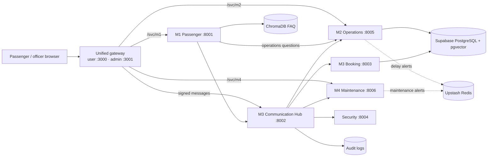

# RailSense AI

<p align="center"></p>

**Four AI agents. One seamless railway experience. Built for the future of Sri Lankan railways.**

RailSense AI is a multi-agent railway intelligence platform for Sri Lanka Railways. Four specialised
agents — a passenger assistant, an operations and delay-prediction agent, a communication hub with a
booking and fraud-security agent, and a maintenance agent — work together through one secure hub
and one shared train registry. It covers passenger self-service in English, Sinhala and Tamil, live
train positions and delay prediction, deterministic booking with QR tickets, fraud screening,
incident management, and rolling-stock maintenance.

Built for **IT3041 – Information Retrieval and Web Analytics** (SLIIT) with FastAPI services, machine
learning, NLP, information retrieval and RAG, LLMs, Supabase PostgreSQL + pgvector, and browser portals.

---

## Contents

1. [Team](#team)
2. [How the assignment requirements are met](#how-the-assignment-requirements-are-met)
3. [Portals and ports](#portals-and-ports)
4. [Architecture](#architecture)
5. [Modules](#modules)
6. [Quick start](#quick-start)
7. [Installation and configuration](#installation-and-configuration)
8. [Running the platform](#running-the-platform)
9. [APIs and health checks](#apis-and-health-checks)
10. [Evaluation](#evaluation)
11. [Testing](#testing)
12. [Database setup](#database-setup)
13. [Security, ethics and responsible AI](#security-ethics-and-responsible-ai)
14. [Repository layout](#repository-layout)
15. [Known limitations](#known-limitations)
16. [Troubleshooting](#troubleshooting)
17. [Project information](#project-information)

---

## Team

| Module | Responsibility | Member |
| --- | --- | --- |
| **M1** | Passenger Assistant — multilingual chat, NLU, FAQ RAG, Choo widget | **Thisarani Kawya** |
| **M2** | Operations & Delay Prediction — ML, incident NLP/RAG, live journeys, Control Room, RBAC admin, Operations Assistant | **Pasindi Alawatta** (team leader) |
| **M3** | Communication Hub, Booking & Security — signed routing, audit, deterministic booking, fraud model | **Navoda Dasun** |
| **M4** | Maintenance & Asset Intelligence — asset-health ML, maintenance flags, manual RAG, engineer assistant | **Primesh Marasingha** |

---

## How the assignment requirements are met

| Requirement | Where it is implemented |
| --- | --- |
| **One or more LLMs** | M1 passenger replies via OpenRouter (free-model fallback chain); M2 Operations Assistant with **Gemini function calling** over fixed data tools; M4 engineer assistant via **Groq** (Qwen). Every LLM answer is grounded: M2 and M4 reject any number or ID the LLM writes that is not in the retrieved evidence. |
| **NLP techniques** | Intent classification (M1, M2 keyword rules + TF-IDF fallback, M4), **named-entity recognition** of stations, trains, dates, times, classes, IDs (M1, M2 passenger query, M4 train/asset NER with typo tolerance), incident **classification and extractive summarisation** (M2), technician-note extraction (M4), NIC normalisation (M3), template NLG. |
| **Information retrieval** | Supabase **pgvector** + local **TF-IDF** incident retrieval (M2, P@1 = 1.0), manual retrieval with relevance thresholds and re-ranking (M4), ChromaDB FAQ retrieval (M1), IR over live records (flags, inspections, timetables). |
| **RAG** | M2 explains predictions with retrieved past incidents and sizes live map alerts by retrieving similar incidents; M4 answers from retrieved manual sections plus live flags/inspections; M1 answers FAQs with citations. |
| **Security features** | JWT-signed inter-agent messages verified by the Hub, allowlisted interactions, bcrypt officer passwords, signed expiring officer tokens, **role-based access control**, input sanitisation (bleach, schema validation, HTML rejection), rate limiting, circuit breakers, HMAC-hashed NIC numbers, append-only audit logs, admin-only incident approval. |
| **Agent communication protocols** | HTTP/JSON with an MCP-style `AgentMessage` envelope through the M3 Hub (`/messages`), agent start-up handshake (`POST /register`), gateway pass-through (`/svc/<agent>`), Upstash Redis pub/sub for delay and maintenance alerts. |
| **Fairness, explainability, transparency, data protection** | Model explanations and feature importance, confidence labels, "estimate, not a live signal" wording, cited sources on every answer, technique badges (LLM / NLP / IR / RAG) in the Operations Assistant, human-in-the-loop fraud and cancellation review, public map shows only admin-verified incidents with an allowlist of fields, masked NICs, secrets only server-side. |

---

## Portals and ports

Browsers use **two ports only** — one for passengers, one for officers. Every agent runs on an
internal port that `start.py` chooses on each laptop (defaults in `railsense_ports.json`). Pages reach
agents through the gateway (`/svc/m1`, `/svc/m2`, `/svc/m4`), so no page hard-codes a port.

| Side | Default port | What's there |
| --- | ---: | --- |
| **User side** | **3000** | Passenger portal and live train board, booking desk, confirmation / QR verification, M1 chat app, M2 delay popup, Choo assistant, verified-incident map |
| **Admin side** | **3001** | Officer login, command deck, M2 Control Room + Admin Console, M3 fraud and cancellation queues, Hub monitor, Security page, M4 maintenance |

| Internal agent | Default port | Purpose |
| --- | ---: | --- |
| M1 Passenger Assistant | 8001 | Multilingual chat, NLU, FAQ RAG, dispatch |
| M3 Communication Hub | 8002 | JWT verification, allowlisted routing, audit, rate limiting, circuit breakers |
| M3 Booking Agent | 8003 | Schedules, seat holds, fares, bookings, cancellations, waiting lists |
| Security & Fraud Agent | 8004 | IsolationForest risk scoring and review workflow |
| M2 Operations Agent | 8005 | Delay prediction, live journeys, incident NLP/RAG, verified map, passenger answers, Operations Assistant, Control Room, Admin Console |
| M4 Maintenance Agent | 8006 | Asset health, maintenance flags, reports, manual RAG, engineer assistant |

If a default port is busy, `start.py` stops it when an earlier RailSense run left it behind, or moves
to the next free port when another program owns it — and tells every agent and page.

Main URLs:

- Passenger portal: `http://localhost:3000/user` (chat `…/user/chat`, booking `…/user/booking`, tickets `…/user/confirmation`)
- Officer portal: `http://localhost:3001/admin` (login `http://localhost:3001/login`)
- Opening an admin page on 3000 (or a passenger page on 3001) forwards you to the right side.

---

## Architecture



- **Hub-mediated agent traffic.** A sender creates an `AgentMessage` envelope signed with a JWT; the
  Hub validates the schema, sender and audience, checks the interaction allowlist, audits the event and
  forwards it to the receiver. Agents announce themselves at start-up (`POST /register`, read-only).
- **One train registry.** The Supabase `trains` table is canonical. M4 can mark a train
  `OUT_OF_SERVICE`; M3 then rejects new bookings with `TRAIN_UNDER_MAINTENANCE` until the flag clears.
- **Deterministic money and seats.** Availability and fares are computed by the booking service,
  never by an LLM; cancellations and flagged bookings are reviewed by humans.
- **One clock.** Every "today", live position and map cut-off uses Asia/Colombo time.

---

## Modules

### M1 · Passenger Assistant — Thisarani Kawya

- Sinhala / Tamil / English script detection and replies in the passenger's language.
- Intent classification (schedules, fares, delays, train status, bookings, cancellations, policies,
  complaints) and entity extraction (stations, train, date, time, class, passenger count).
- ChromaDB FAQ retrieval with citations; LLM phrasing through OpenRouter (tries several free models
  in turn), falling back to the raw FAQ text when no key is set.
- Train operations questions ("any train to Polonnaruwa after 19:15?", "where is the Night Mail now?",
  "when will DM-8055 reach Kurunegala?", "which trains are delayed?") are answered by M2 from the live
  timetable (`/passenger/query`); fares, policies and bookings stay with M1.
- React chat app (served at `/user/chat`) and the **Choo** floating assistant on the passenger portal.
- Reads `backend/.env` first, then the root `.env`.

### M2 · Operations & Delay Prediction — Pasindi Alawatta

Full documentation: [`M2-operations-agent/README.md`](M2-operations-agent/README.md).

- **Delay model:** `GradientBoostingRegressor` with exact historical lookup first; retrained on the
  refreshed corpus (3,900 records, 2026-03-01 → 2026-09-27): **MAE 2.25 min, R² 0.894**.
- **Live journeys (`live_tracker.py`):** station-by-station timetable (intermediate times by track
  distance), live position on the Asia/Colombo clock, correct overnight handling (a 19:15 → 04:30 train
  is "not yet departed" at 18:52), and **verified map incidents on a train's path delay every later
  stop**, each sized by retrieving similar past incidents (IR).
- **Passenger popup (`/passenger/ask`)** and **free-text passenger queries (`/passenger/query`)**:
  intent rules + TF-IDF fallback for typos, station/train/time NER, journey search ("trains to X after
  19:15"), station ETAs, incident and network overviews.
- **Incident pipeline:** sanitised reports → classification + summarisation → `pending` → admin
  Approve/Reject → verified map on all three portals within 5 s, current day only.
- **Operations Assistant:** Gemini function calling over seven role-filtered data tools, number guard,
  fixed refusal messages, per-user history, and **technique badges** (LLM · NLP · IR · RAG · ML ·
  Explainable AI · Security · Protocol · Responsible AI) computed from what actually ran.
- **Control Room and Admin Console:** 3D banners, KPIs, heatmaps, model metrics, incident management,
  officer RBAC (bcrypt, signed tokens, last-admin lock-out), retraining with archived versions and
  rollback, audit explorer, live health (Supabase, Hub, Upstash).
- **Corpus refresh:** `data/refresh_corpus.py` keeps every record, moves dates up to yesterday, adds
  recent records, upserts Supabase and indexes new notes in pgvector (re-runnable).

### M3 · Communication Hub, Booking & Security — Navoda Dasun

- **Hub:** schema validation, JWT authentication, interaction authorisation, registry lookup,
  deduplication, rate limiting, circuit breakers, SQLAlchemy audit, live monitor
  (`/api/hub/dashboard`, `/api/hub/timeline`), start-up handshake `POST /register`.
- **Booking:** schedules, first/second-class availability, deterministic fares, seat holds, idempotent
  bookings, QR e-tickets and verification, cancellations with NLP-explained human review, waiting lists,
  maintenance-aware booking blocks, admin booking copilot.
- **Security & Fraud agent:** behavioural features (booking velocity, cancellation ratio, duplicate
  seats, route switching, timing) → IsolationForest → `LOW/MEDIUM/HIGH` with `ALLOW/REVIEW/REJECT`;
  reviewers label outcomes in the fraud queue.

### M4 · Maintenance & Asset Intelligence — Primesh Marasingha

- Asset-health scoring from service age, fault history and telemetry (per-type gradient boosting),
  technician-note extraction, maintenance reports, manual search, maintenance flags that sync to the
  train registry.
- **Engineer assistant (`/chat`, `rag/ops_status.py`)** answers operational questions with
  **NLP → IR → RAG → LLM**: intent + train NER (name, typo, M4 id `T-00x`, service number, shared id,
  loco or asset id) → live flags, latest inspections and open reports → manual sections retrieved for the
  specific fault or the fitness-to-run limits (relevance threshold + re-ranking) → Groq LLM answer that
  is rejected if it contains any number or ID not in the evidence (template fallback). Examples: "What
  trains are unavailable today due to maintenance issues?", "Is the Yal Devi running today? I have a
  booking on it." Technical questions ("how do I diagnose an oil leak?") use the manual RAG as before.
- Maintenance alerts published to Upstash Redis (`maintenance_alert`); LLM via Groq. Keys live in
  `M4-maintenance-agent/.env` (git-ignored).

### Unified gateway (`frontend/serve.py`)

Serves both public sides, forwards pages to the correct side, publishes `/railsense-config.js` (the
ports in effect), passes browser calls through to agents (`/svc/m1|m2|m4`), signs trusted Hub
messages server-side, proxies booking and admin APIs, and never exposes database credentials or the
inter-agent secret to browsers. One RailSense logo is used in every header (M1–M4, user and admin).

---

## Quick start

```bash
git clone <repo> && cd RailSence-AI
cp .env.example .env            # fill in the team's shared values (ask the team leader privately)
python check_setup.py           # shows exactly what this laptop is missing
python start.py                 # starts everything and prints the two URLs
```

Open `http://localhost:3000/user` (passengers) and `http://localhost:3001/admin` (officers).

---

## Installation and configuration

Prerequisites: **Python 3.10+**, **Node.js 18+** (npm), Git. Everyone uses the same Supabase project.

All agents run on **one Python** (per-module venvs differ between laptops, and Windows Smart App Control
can block packages inside a venv). From the repository root:

```bash
python -m pip install -r M1-passenger_assistant/backend/requirements.txt
python -m pip install -r M2-operations-agent/requirements.txt
python -m pip install -r "M3-Comunication-Hub&Booking-Agent/agent-hub/requirements.txt"
python -m pip install -r "M3-Comunication-Hub&Booking-Agent/booking-agent/requirements.txt"
python -m pip install -r M4-maintenance-agent/requirements.txt
python -m pip install psutil
```

If a pinned package has no build for your Python (for example old `pandas` on Python 3.13), install only
the missing packages at current versions instead of downgrading working ones — `check_setup.py` lists
them per agent.

**`.env`** (git-ignored; template in `.env.example`, which explains every key):

| Key | Needed for |
| --- | --- |
| `SUPABASE_URL`, `SUPABASE_SECRET_KEY`, `DATABASE_URL` | Shared database (required) |
| `JWT_SECRET_KEY` | Gateway ↔ Hub signed messages (required, identical on every laptop) |
| `NIC_HMAC_SECRET` | NIC hashing for bookings (required, **identical on every laptop** or duplicate/fraud checks disagree) |
| `GEMINI_API_KEY` | M2 Operations Assistant LLM (optional — rule-based fallback) |
| `OPENROUTER_API_KEY` | M1 LLM replies (optional, needs the `openai` package) |
| `UPSTASH_REDIS_URL`, `UPSTASH_REDIS_TOKEN` | M2 delay-alert pub/sub (optional) |

`M4-maintenance-agent/.env` holds M4's own `UPSTASH_REDIS_URL/TOKEN` and `GROQ_API_KEY`. Don't put
ports or agent URLs in `.env` — the launcher sets them.

---

## Running the platform

```bash
python start.py
```

It checks the setup, chooses the ports, builds the M1 chat app when its sources changed, starts all six
agents and both portal sides in one terminal (logs prefixed by service), waits until each is healthy and
prints the two URLs. `Ctrl+C` stops everything.

| Command | What it does |
| --- | --- |
| `python start.py --status` | Which ports are free / used by RailSense / used by other programs |
| `python start.py --stop` | Stop everything this repository started (never other programs) |
| `python start.py --no-build` / `--rebuild` | Skip / force the M1 chat build |
| `python start.py --no-reload` | Run agents without auto-reload (lighter on older laptops) |
| `python check_setup.py` | Packages per agent, `.env` keys (names only), Node.js, ports |

`start_all.bat`, `start_all.ps1`, `start_all.sh`, `backend.bat`, `frontend.bat` and `stop_all.ps1` are
one-line wrappers around `start.py`. `run_backend.py` / `run_frontend.py` (used by the startup tests)
read the same `railsense_ports.json`. To run one agent by hand, use its port from that file, e.g. from
`M2-operations-agent/`: `python -m uvicorn main:app --host 127.0.0.1 --port 8005 --reload`.

---

## APIs and health checks

Every backend exposes `/health`; open `/docs` on a service for its Swagger contract.

| Service | Key routes |
| --- | --- |
| Gateway | `/user…`, `/admin…`, `/login`, `/railsense-config.js`, `/svc/{m1\|m2\|m4}/…`, `POST /api/chat`, `/api/train-board`, `/api/booking-options`, booking/cancellation routes, `/api/admin/*`, `/api/admin/system-health`, `/api/hub/*` |
| M1 | `POST /chat`, `GET /chat/{session}/history`, `/health` |
| Hub | `POST /messages`, `POST /register`, `/health`, `/ready`, `/api/hub/dashboard`, `/api/hub/timeline` |
| Booking | `/internal/messages`, booking, hold, cancellation, waiting-list, schedule, ticket-verification routes |
| Security | `POST /internal/fraud-score`, fraud-review routes, `/health` |
| M2 | `POST /predict-delay`, `POST /passenger/ask`, `POST /passenger/query`, `POST /incident-report`, `/incidents` (+ `approve` / `reject`), `/api/incidents/map-feed`, `/api/dashboard`, `/api/route-options`, `/api/trains`, `/api/stations`, `/api/ops-agent/ask`, `/history`, `/capabilities` |
| M2 admin | `POST /admin/api/login`, `/admin/api/me`, officer, model, audit and health routes |
| M4 | `POST /chat`, `POST /asset-health`, `POST /maintenance-report`, `GET /manual-search`, `POST/DELETE /api/flag-train`, `/api/train-status/{id}`, `/api/trains-under-maintenance`, `/api/dashboard`, `/hub/message` |

---

## Evaluation

| Component | Result |
| --- | --- |
| M2 delay model | 3,900 records (3,120 train / 780 test); **MAE 2.254 min, RMSE 2.837 min, R² 0.894** |
| M2 incident NLP | 400 records; 100% classification accuracy |
| M2 incident retrieval | P@1 1.000, P@3 1.000, P@5 0.999 |
| Security model | 600 records; 99.17% accuracy, 100% recall, 3.86 ms average latency |
| M4 health model | 600 records; MAE 3.757, RMSE 5.305, R² 0.881 |
| M4 note NLP | 118 records; 89.83% accuracy |
| M4 manual retrieval | P@1, P@3 and P@5 all 1.000 |

The committed JSON artifacts under each `evaluation/` directory are the source of truth; retraining
updates them.

---

## Testing

```bash
python -m pytest M2-operations-agent/tests -q          # 57 tests incl. live tracker and passenger query NLP
python -m pytest "M3-Comunication-Hub&Booking-Agent/tests" -q
python -m pytest M1-passenger_assistant/backend/tests -q
python -m pytest test_m2_rbac.py -q
python test_portals.py
python test_startup_commands.py
python test_full_system_integration.py
python test_integration.py
python scripts/test_m1_m2_integration.py
python scripts/test_m3_booking_integration.py
python scripts/test_m4_cross_agent_integration.py
```

Model and retrieval evaluation:

```bash
python security-agent/evaluate_model.py
python M2-operations-agent/ml/train_delay_model.py
python M2-operations-agent/nlp/evaluate_nlp.py
python M2-operations-agent/evaluation/rag/evaluate_retrieval.py
python M4-maintenance-agent/ml/train_health_model.py
python M4-maintenance-agent/nlp/evaluate_nlp.py
python M4-maintenance-agent/evaluation/rag/evaluate_retrieval.py
```

---

## Database setup

- `supabase_shared_trains.sql` — canonical train registry (`scripts/seed_shared_trains.py`,
  `scripts/validate_shared_train_links.py`).
- `M1-passenger_assistant/backend/supabase_schema.sql` — M1.
- `M3-Comunication-Hub&Booking-Agent/supabase_schema.sql` — Hub and Booking.
- `M4-maintenance-agent/supabase_schema.sql`, `supabase_setup_all.sql` — M4.
- `M2-operations-agent/supabase_phase5_schema.sql`, `admin/admin_schema.sql`,
  `admin/incident_map_migration.sql`, `admin/ops_agent_migration.sql` (adds `answer_method`) — M2.
  M2 runs on local fallbacks until these are applied.

---

## Security, ethics and responsible AI

- **Secrets:** `.env` files, Supabase server keys, JWT and HMAC secrets stay out of git and out of the
  browser. Share team values privately; rotate any key that was pasted into a chat.
- **Authentication and access:** bcrypt officer passwords, signed expiring tokens, role-based tools and
  pages, last-admin lock-out, admin-only incident approval and model management.
- **Input handling:** schema validation, bleach sanitisation, HTML rejection in incident text, rate
  limits on public endpoints, signed and deduplicated Hub messages.
- **Grounding and transparency:** answers cite their sources; LLM output with unsupported numbers or IDs
  is replaced by a grounded template; predictions carry confidence and "estimate" wording; technique
  badges show which AI techniques produced an answer.
- **Human in the loop:** fraud reviews, cancellations and public incident alerts require a person.
- **Data protection:** NICs are HMAC-hashed and masked; the public map exposes only verified incidents
  and an allowlist of fields; audit logs are read-only in the UI.

---

## Repository layout

```text
RailSence-AI/
├── start.py · check_setup.py · railsense_ports.json   one launcher, setup check, port registry
├── frontend/                          unified gateway (serve.py) and passenger / admin portals
├── M0-homepage/                       project landing page (Next.js)
├── M1-passenger_assistant/            passenger backend (FastAPI) and React chat app
├── M2-operations-agent/               delay ML, live tracker, incident NLP/RAG, Control Room, RBAC admin, Operations Assistant
├── M3-Comunication-Hub&Booking-Agent/ central Hub, Booking agent, shared schemas and SQL
├── security-agent/                    fraud scoring service
├── M4-maintenance-agent/              asset intelligence, manuals, flags, engineer assistant (rag/ops_status.py)
├── shared/                            train registry helpers, ports.py
├── scripts/                           seeding, validation and cross-agent tests
├── start_all.* · backend.bat · frontend.bat · stop_all.ps1   wrappers around start.py
└── test_*.py                          startup, portal, RBAC and integration tests
```

---

## Known limitations

- **M4 is not connected to the shared database yet** (it reads only its own `.env`, which has no
  Supabase keys). It works on local data, so the "flag a train → Booking stops selling seats" link does
  not reach M3, and the invented-train-ID check is skipped. Loading the root `.env` in M4 is the fix
  (owner decision).
- **M4 uses its own train numbers** (e.g. Yal Devi #1001 / `T-003`) while the rest of RailSense uses
  service numbers such as 4085; the M4 assistant accepts both.
- **M1 routing:** "which trains are unavailable due to maintenance" and "is my booked train running"
  are not yet routed to M4 from the passenger chat.
- Intermediate station times are estimated from track distance between the published departure and
  arrival, not from an official per-stop timetable.
- `spacy` is listed in M1's requirements but not used by the code.

---

## Troubleshooting

| Symptom | Fix |
| --- | --- |
| A page works on one laptop but not another | `python check_setup.py`, then `python start.py` (never start agents with old per-port commands) |
| "Port in use" / services on odd ports | `python start.py --status`; RailSense leftovers are stopped automatically, other programs are skipped |
| Choo says "can't reach the assistant" | M1 is not running — check the `[M1 …]` lines in the `start.py` log |
| M1 replies are raw FAQ text | Add `OPENROUTER_API_KEY` to `.env` and `pip install openai`, then restart |
| Officer pages ask to log in again | The admin side moved to port 3001 — log in once there |

---

## Project information

- **Course:** IT3041 – Information Retrieval and Web Analytics
- **Institution:** Sri Lanka Institute of Information Technology (SLIIT)
- **Project:** RailSense AI — Thisarani Kawya (M1), Pasindi Alawatta (M2, team leader), Navoda Dasun (M3), Primesh Marasingha (M4)
- **Licence metadata:** MIT (see `package.json`)
