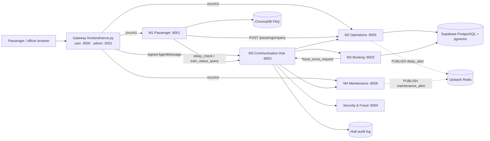

# RailSense AI: Final Report Fact Base (prep.md)

## How to use this file

This is the fact base for writing the IT3041 final report. Every fact points to the file (and function or line) it came from, so it can be defended in the viva. Metrics are copied exactly from the committed evaluation artifacts or from a run on 2026-09-29. Wording is kept positive, and each claim is limited to what the code shows. Section 12 gives the exact phrasing to use where the planning docs or README say something different from the code. No secret values appear here, only key names.

## Top 10 things the report must get right

(1) The LLMs really called are **OpenRouter free models (M1), Google Gemini with function calling (M2 Operations Assistant, M3 admin copilot and cancellation NLP, Security summaries) and Groq-hosted Qwen (M4)**. Claude is an *optional* path (M2/M4 NLP) that is used only when `ANTHROPIC_API_KEY` is set. (2) The platform is launched with **`python start.py`**, which picks ports, starts 6 agents and 2 gateway sides, and health-checks them all. A `docker-compose.yml` exists as the containerised deployment layout. (3) The inter-agent protocol is a **custom, JWT-signed `AgentMessage` envelope (schema v1.1) over HTTP/JSON** through the M3 Hub. Call it "MCP-inspired" at most, not MCP. (4) The **Hub pipeline** has 9 enforced steps: schema, JWT (sender + audience binding), hop-count loop guard (≤5), sliding-window rate limit (5/s, 30/min), a 14-rule interaction allowlist, deduplication, registry, circuit breaker (3 failures / 10 s) with 2 retries, and audit. (5) NICs are protected with **HMAC-SHA256 hashing plus masking**, not AES. (6) **M2 delay model:** GradientBoostingRegressor, 3,900 records (3,120/780), **MAE 2.254 min, RMSE 2.837 min, R² 0.8941**. (7) **M2 incident retrieval (Supabase pgvector, 150 queries): P@1 = 1.0, P@3 = 1.0, P@5 = 0.9987.** (8) **Security model (re-run 2026-09-29, 600 samples): accuracy 99.17%, recall 100%, precision 93.51%, F1 0.9664.** (9) **M4 health model artifact: 1,440 rows, average R² 0.9147, average MAE 3.2047.** Use these numbers, not the README's older "600 records / R² 0.881". (10) **Grounding guards:** M2 (`ops_agent.numbers_grounded`) and M4 (`rag/ops_status._grounded`) reject any LLM answer that contains a number or ID not found in the retrieved evidence, and fall back to a template answer. Tests: **M2 57/57 passed; M3 229 passed** (run 2026-09-29).

## Table of contents

0. Report template
1. Problem, domain and users
2. System architecture
3. Agent roles
4. Agent communication protocol
5. Methodology
6. Evaluation results
7. Responsible AI
8. Security implementation
9. UI and portals
10. Commercialization inputs
11. Individual contributions
12. Wording guide (keep claims accurate)
13. Future work
14. Questions for Pasindi

---

## 0. Report template

- The Week 2 report template is **not in the repository**. Searches for `*template*`, `.docx`, `.pdf`, `/docs`, `/report` and `/assignment` found only library files inside `venv/`. No page or word limit is mentioned anywhere in the repo.
- Brief requirements (from your prompt): system design, methodology, Responsible AI, commercialization (with pricing), evaluation. Sections 2–10 below map onto these.
- Related material: `student4_audit/REPORT_INPUT_PACK.md` (untracked) is a separate Student 4 security-assessment pack with its own required sections (A→I). Keep this final report consistent with it (see Q3 in Section 14).

## 1. Problem, domain and users

Sri Lanka Railways passengers and staff lack a single trilingual, real-time assistant for timetables, delays, bookings, incidents and maintenance. RailSense AI provides four cooperating agents behind one gateway (`README.md` intro).

| User | What they get (implemented) | Evidence |
| --- | --- | --- |
| Passenger | Chat in English/Sinhala/Tamil with script detection; fares, policies, schedules via FAQ RAG; live train questions answered by M2; booking with QR e-ticket; verified-incident map | `M1…/backend/main.py:chat` (L1112), `nlu/lang_detect.py`, `frontend/serve.py:/api/bookings/confirm` (L1148), `M2…/incident_map.py` |
| Control-room officer (operations_engineer) | Control Room KPIs, delay prediction, Operations Assistant | `M2…/admin/admin_auth.py:ROLE_PERMISSIONS`, `ops_agent.py` |
| Administrator | Officer RBAC, incident approve/reject, model retrain/rollback, audit explorer | `M2…/admin/admin_router.py` (`/model/retrain`, `/model/rollback/{filename}`, `/officers…`), `main.py:approve_incident` L1628 |
| Security reviewer | Fraud review queue and cancellation review with NLP explanation | `booking-agent/main.py` `/internal/fraud-reviews…`, `/internal/cancellations/{case_reference}/review`; `frontend/serve.py` `/api/admin/fraud-reviews` |
| Maintenance engineer | Asset health scoring, maintenance reports, manual search, engineer chat, train flags | `M4…/main.py` `/asset-health`, `/maintenance-report`, `/manual-search`, `/chat`, `/api/flag-train` |

## 2. System architecture

### 2.1 Services

| Service | Default port | Entry | Started by |
| --- | ---: | --- | --- |
| Gateway, user side | 3000 | `frontend/serve.py` (`RAILSENSE_SIDE=user`) | `start.py` main(), L240–243 |
| Gateway, admin side | 3001 | `frontend/serve.py` (`RAILSENSE_SIDE=admin`) | same |
| M1 Passenger Assistant | 8001 | `M1-passenger_assistant/backend/main.py` | `start.py` `SERVICES`, `uvicorn main:app` |
| M3 Communication Hub | 8002 | `M3…/agent-hub/main.py` | same |
| M3 Booking Agent | 8003 | `M3…/booking-agent/main.py` | same |
| Security & Fraud Agent | 8004 | `security-agent/main.py` | same |
| M2 Operations Agent | 8005 | `M2-operations-agent/main.py` | same |
| M4 Maintenance Agent | 8006 | `M4-maintenance-agent/main.py` | same |

- Ports come from `railsense_ports.json`. `shared/ports.py:resolve` moves off busy ports and writes `.railsense/ports.runtime.json`. `service_env()` passes every agent URL to every process (`AGENT_HUB_URL`, `OPERATIONS_AGENT_URL`, …).
- `start.py` also rebuilds the M1 React app when its sources change (`build_m1`), runs `check_setup.py`, health-polls every service for up to 120 s, and supports `--stop`, `--status`, `--no-build`, `--rebuild` and `--no-reload`.
- **Containers:** `docker-compose.yml` defines 6 services (hub, passenger, booking, security, operations, maintenance) with a Hub health check. `M4-maintenance-agent/Dockerfile` exists. The day-to-day launcher is `start.py`.

### 2.2 Gateway (`frontend/serve.py`, 2,467 lines)

- Serves pages: `/user`, `/user/booking`, `/user/confirmation`, `/user/chat` (M1 React build), `/login`, `/admin`, `/admin/operations/*`, `/admin/bookings`, `/admin/maintenance`, `/admin/security`, `/admin/hub`, `/admin/cancellations`.
- `/railsense-config.js` publishes the live ports to the browser (L144).
- `/svc/{agent}/{path}` passes calls through to M1, M2 and M4 (`svc_proxy`, L167), so no page hard-codes a port.
- **Signs Hub messages server-side:** `/api/bookings/confirm` (L1148) and `/api/cancellations/confirm` (L1415) create a JWT with `JWT_SECRET_KEY`, which never reaches the browser, wrap the request in an `AgentMessage`, and POST it to `{HUB_URL}/messages`.
- Passenger APIs: `/api/chat` (booking/cancellation intent detection, otherwise forwards to M1), `/api/train-board`, `/api/booking-options`, `/api/holds`, `/api/waiting-list`, `/api/tickets/{ref}`, `/api/tickets/verify/{token}`.
- Admin APIs: `/api/auth/login|logout|me`, `/api/admin/cancellations…`, `/api/admin/fraud-reviews…`, `/api/admin/trains`, `/api/admin/bookings`, `/api/admin/system-health`, `/api/hub/dashboard`, `/api/hub/timeline` (with `humanize_hub_error`).

### 2.3 End-to-end scenarios (traced)

**A. "Is train X delayed?"**
1. Browser → gateway `/svc/m1/chat` (or `/api/chat`) → M1 `main.py:chat` (L1112).
2. `detect_language` → `is_greeting` → `classify_intent` → NER (`nlu/ner_extractor.py`).
3. For English operations intents (`_OPERATIONS_INTENTS = {delay_check, train_status, train_info, schedule_query, unknown}`, L1093), M1 POSTs to M2 `/passenger/query` (L1097–1100).
4. M2 `main.py:passenger_query` (L1136) → `nlp/passenger_query.parse` (intent, time, date, stations with fuzzy matching, train id/number/name) → answer from the live board, `live_tracker.py` journey and verified incidents → reply returned to M1.
5. Hub path (also implemented): M1 `hub_client.build_envelope(receiver="operations-agent", intent="delay_check")` → Hub `/messages` → M2 `/hub/message` (L1811), which validates the payload and returns `intent: "delay_check_response"` (L1927).

**B. Booking a ticket**
1. Browser → gateway `/api/bookings/confirm` → signed `AgentMessage` (`passenger-agent` → `booking-agent`, `booking_request`) → Hub `/messages` (allowlisted) → Booking `/internal/messages`.
2. `booking/service.py:process_booking` (L150): validate NICs → duplicate-NIC check → train/schedule lookup → duplicate-ticket rule → overlap rule → seat availability → deterministic fare → behavioural features → `fraud/client.request_fraud_score` (via Hub `fraud_score_request`, with a direct call as fallback; fails closed to human review).
3. Security agent IsolationForest → `LOW` → confirmed booking with ticket token and QR (`booking/qr_service.py`), plus a confirmation email (`notifications/email_service.py`). `MEDIUM`/`HIGH` → `FraudReview` with status `PENDING_REVIEW`, and the gateway returns `PENDING_FRAUD_REVIEW`.

**C. Maintenance status on a train**
- M4 manages flags through `POST /api/flag-train`, `DELETE /api/flag-train/{train_id}`, `GET /api/train-status/{train_id}` and `GET /api/trains-under-maintenance` (`M4…/main.py` L967–1063), and publishes `maintenance_alert`.
- Booking reads `trains.maintenance_status`. When it is `OUT_OF_SERVICE`, `booking/availability.py` (L241, L727) raises `TrainUnderMaintenanceError` → `TRAIN_UNDER_MAINTENANCE` (`booking/exceptions.py:130`). `shared/train_repository.py:231` maps `OUT_OF_SERVICE`/`DECOMMISSIONED` to an out-of-service status. A seeded demo train shows this (`database/seed.py` L61–69).
- In the report, describe these as "M4 flag management" and "maintenance-aware booking block". See Section 12, row 8.

**D. Incident report → public map**
1. `POST /incident-report` (M2 `main.py:incident_report`, L1470). Pydantic validation: `raw_text` 5–2000 characters, control characters rejected, and any markup rejected via `bleach.clean(tags=[])` (L489–505).
2. `nlp/classify_incident.classify_incident` and `nlp/summarize_incident.summarize_incident` → stored with `review_status: "pending"` (`admin_db.create_incident`) and indexed for RAG.
3. Admin approves or rejects: `POST /incidents/{id}/approve|reject` requires the `m2.incidents.review` permission (admin only) (L1628–1640).
4. `GET /api/incidents/map-feed` (L1643) → `incident_map.py`: only `verified` incidents from today (Asia/Colombo midnight), through a public field allowlist (`public_item`, L77). Shown on the user, admin and Control Room maps.

### 2.4 Data layer

| Store | Used for | Evidence |
| --- | --- | --- |
| Supabase PostgreSQL | Booking tables: `trains`, `train_schedules`, `bookings`, `cancellation_requests`, `audit_logs`, `passengers`, `booking_passengers`, `fraud_reviews`, `seat_holds`, `waiting_list_entries`, `idempotency_records`, `fraud_investigation_labels` (SQLAlchemy) | `booking-agent/database/models.py` |
| Supabase (M2) | `operations_history`, `incident_embeddings`, `audit_events`, `operational_events`, `operation_entities`, `incident_reports`, `model_training_runs`, `admin_config`, `officers`, `officer_audit_logs`, `ops_agent_queries` | `supabase_phase5_schema.sql`, `admin/*.sql` |
| Supabase (M1, M4) | M1 `chat_sessions`, `chat_summaries`; M4 `assets_history`, `audit_events`, `operational_events`, `manual_embeddings` | `M1…/supabase_schema.sql`, `M4…/supabase_setup_all.sql` |
| pgvector (384-dim, all-MiniLM-L6-v2) | M2 incidents (`match_incidents` RPC), M3 `cancellation_policy_embeddings`, M4 `manual_embeddings` | `M2…/rag/incident_retriever.py:82`, `M3…/supabase_schema.sql:191` |
| Hub audit | SQLAlchemy on Supabase `DATABASE_URL`; SQLite only in the test environment | `agent-hub/hub_database.py` L83–95 |
| ChromaDB | M1 FAQ collection `passenger_faq` (persistent `.chroma/`) | `M1…/rag/embed_documents.py` |
| Upstash Redis (REST) | `PUBLISH delay_alert` (M2) and `PUBLISH maintenance_alert` (M4) | `M2…/hub_client.py:77–99`, `M4…/hub_client.py:64–91` |
| Local fallbacks | M2 runs on CSV/JSONL (`data/`) and local TF-IDF when Supabase is unreachable; M4 uses local TF-IDF over manuals | `incident_retriever.py:138` (`method: local_tfidf`), `manual_retriever.py:147` |

### 2.5 Mermaid diagram (safe to paste)



## 3. Agent roles

### M1 Passenger Assistant (owner: Thisarani Kawya)
- **Endpoints:** `POST /chat`, `GET /chat/{session_id}/history`, `GET /chat`, `GET /trains/{train_id}/details`, `POST /feedback`, `GET /health`.
- **NLP:** keyword intent classifier with 7 intents (`train_status`, `delay_check`, `cancel_booking`, `booking_request`, `fare_query`, `schedule_query`, `complaint`) plus greeting, policy and engineering checks (`nlu/intent_classifier.py`). Language detection by Unicode script counts for Sinhala/Tamil, with `langdetect` for the rest (`nlu/lang_detect.py`). Regex/alias NER for stations, train name/number, dates, times, class and passenger count (`nlu/ner_extractor.py`). Trilingual reply templates (`i18n.py`).
- **RAG:** 3 FAQ documents (`fares.md`, `policies.md`, `schedules.md`), chunked by markdown `##` header, embedded with all-MiniLM-L6-v2 into ChromaDB, `top_k=3` with an intent-based source filter (`rag/retriever.py:38`).
- **LLM:** OpenRouter through the OpenAI SDK. Model chain: `google/gemma-4-31b-it:free` → `google/gemma-4-26b-a4b-it:free` → `qwen/qwen3.8-27b:free` → `openrouter/free`. The chain can be overridden with `OPENROUTER_MODEL`. Without a key it returns the retrieved FAQ text (`llm_client.py`).
- **Sends:** `delay_check`, `train_status_query`, `issue_report` via the Hub (`hub_client.py`), and `/passenger/query` directly to M2.

### M2 Operations & Delay Prediction (owner: Pasindi Alawatta, team leader). Full scope:
| Component | What it does | Evidence |
| --- | --- | --- |
| Delay prediction | Exact historical lookup first (confidence "high"); otherwise GradientBoostingRegressor (confidence "medium", or "low" if \|pred\| ≥ 20 or fewer than 10 samples); explanation with retrieved incidents; publishes `delay_alert` when the prediction is ≥ 5 min | `main.py:_compute_prediction` L1309, `hub_client.py:17` |
| Live tracker | Station-by-station timetable, Asia/Colombo clock, overnight trains, verified incidents delay later stops | `live_tracker.py`, `tests/test_live_tracker.py` |
| Passenger answers | `/passenger/ask` (popup) and `/passenger/query` (free text, deterministic NLP) | `main.py` L888, L1136; `nlp/passenger_query.py`, `nlp/passenger_answer.py` |
| Incident pipeline | Sanitise → classify → summarise → pending → admin review → verified map | Section 2.3 D |
| Operations Assistant | Gemini function calling over 7 role-filtered tools, number guard, fixed refusal messages, per-user history, technique badges | `ops_agent.py`, `ops_agent_tools.py` L280–378, `ui/shared/ops-agent.js` L22–45 |
| Control Room UI | KPIs, route status, heatmaps, map, prediction | `ui/index.html`, `ui/shared/*.js` |
| Admin Console + RBAC | Officers, roles matrix, model metrics/versions/feature importances, retrain, rollback, audit, health | `admin/admin_router.py`, `admin_ui/js/views/{home,officers,roles,model,incidents,audit}.js` |
| Corpus refresh | Keeps every record, shifts dates to yesterday, adds recent records (deterministic uuid5 ids), optional Supabase upsert + embedding | `data/refresh_corpus.py` |
| Hub integration | Registers with the Hub at start-up (capabilities `delay_check`, `delay_alert`, `incident_triage`); handles `delay_check` | `hub_client.py:55`, `main.py:hub_message` L1811 |

**M2 endpoints:** `/health`, `/predict-delay`, `/passenger/ask`, `/passenger/query`, `/incident-report`, `/incidents` (GET, PATCH, DELETE), `/incidents/{id}/approve|reject`, `/api/incidents/map-feed`, `/api/dashboard`, `/api/route-options`, `/api/trains`, `/api/stations`, `/route-status/{route_id}`, `/api/ops-agent/ask|capabilities|history`, `/hub/message`, `/internal/messages`. Admin router: `/login`, `/logout`, `/me`, `/officers` (CRUD, status, reset-password, audit), `/roles/matrix`, `/model/metrics|metrics-history|versions|feature-importances|retrain|rollback/{filename}`, `/audit/events|summary`, `/health/status`.

**Operations Assistant tools and permissions** (`ops_agent_tools.py`): `get_dashboard_kpis`, `get_route_status`, `get_incident_queue` (`m2.control_room.view`); `predict_delay` (`m2.prediction.run`); `get_model_metrics` (`m2.model.manage`); `get_audit_log` (`m2.audit.view`); `check_system_health` (`m2.system.config`). `answer_method` records one of `llm_tool_calling`, `template_after_guard` or `rule_based_fallback`.

### M3 Communication Hub, Booking & Security (owner: Navoda Dasun)
- **Hub:** `POST /messages`, `POST /register`, `/health`, `/ready`, `/api/hub/dashboard`, `/api/hub/timeline`. Details in Section 4.
- **Booking (23 routes):** `/booking-options`, `/internal/messages`, `/bookings/{ref}`, `/internal/seat-holds`, `/internal/waiting-list`, `/api/tickets/verify/{token}`, `/operations/status/{idempotency_key}`, `/cancellations…`, `/internal/cancellations/{ref}/review`, `/internal/cancellations/nlp-preview`, `/internal/fraud-reviews…`, `/admin/trains`, `/admin/bookings`, `/admin/chat` (booking copilot).
- **Booking copilot (`admin_chat/`):** intent classifier, entity extractor, date parser, retrieval/RAG context, privacy masking, Gemini (`GEMINI_MODEL`, default `gemini-flash-lite-latest`) with a deterministic fallback (`admin_chat/fallback.py`).
- **Cancellation:** rules plus RAG over 6 policy documents (`cancellation/policies/*.md`), Gemini explanation (`cancellation/llm.py:342`), human review.
- **Security & Fraud agent:** IsolationForest (`n_estimators=100`, `contamination=0.08`, `random_state=42`) on 10 behavioural features. Risk index 0–1: `LOW` (0.00–0.39) → ALLOW, higher bands → REVIEW (`fraud/model.py` L7–12, L51–54). Advisory officer summary from Gemini 2.5 Flash, instructed "Do NOT assert that the passenger committed fraud" (`fraud/llm_summary.py` L270–282).

### M4 Maintenance & Asset Intelligence (owner: Primesh Marasingha)
- **Endpoints:** `/health`, `/api/dashboard`, `/api/assets`, `/asset-health`, `/asset-status/{id}`, `/api/asset-trend/{id}`, `/api/fleet-health-summary`, `/maintenance-report`, `/api/reports/{id}/resolve`, `/manual-search`, `/api/engineer-login`, `/chat-ui`, `/chat`, `/api/flag-train` (POST/DELETE), `/api/train-status/{id}`, `/api/trains-under-maintenance`, `/hub/message`, `/internal/messages`.
- **ML:** per-asset-type HistGradientBoostingRegressor (`max_iter=400`, `learning_rate=0.04`, `max_depth=5`, 80/20 split, `random_state=42`), permutation importance with `n_repeats=8` (`ml/train_health_model.py` L76–97).
- **RAG:** 8 manuals (`manuals/*.txt`), Supabase pgvector (`match_manual_sections`) or local TF-IDF (`max_features=5000`), `top_k=3` (`rag/manual_retriever.py`).
- **LLM:** Groq, `qwen/qwen3.8-27b` (`M4_LLM_MODEL`), `temperature=0.2`, used only when `GROQ_API_KEY` is set. The grounding guard `_grounded` is described in 5.2.

## 4. Agent communication protocol

**Envelope** (`M3…/shared/schemas.py:AgentMessage`, Pydantic v2, whitespace-stripped):

| Field | Type | Default |
| --- | --- | --- |
| message_id | str (min 1) | required |
| sender_agent | str (min 1) | required |
| receiver_agent | str (min 1) | required |
| intent | `MemberCIntent` enum | required |
| payload | dict | required |
| auth_token | str (Bearer JWT) | required |
| timestamp | datetime | required |
| correlation_id | str \| None | None (falls back to message_id) |
| parent_message_id | str \| None | None |
| schema_version | str | "1.1" |
| hop_count | int ≥ 0 | 0 |

**Intents:** `booking_request`, `cancel_booking`, `delay_check`, `delay_check_response`, `delay_alert`, `issue_report`, `incident_report`, `fraud_score_request`, `train_status_query`, `ack`.

**Allowlist** (`agent-hub/main.py:64`, deny by default):

| Sender → Receiver | Intent |
| --- | --- |
| passenger → booking | booking_request, cancel_booking |
| booking → security | fraud_score_request |
| passenger → operations | delay_check |
| operations → passenger | delay_check_response, delay_alert |
| operations → maintenance | issue_report |
| maintenance → operations | incident_report |
| passenger → maintenance | issue_report, train_status_query |
| booking → passenger, security → booking, operations → booking | ack |

**Hub pipeline** (`receive_message`, L242–400):
1. Pydantic schema validation.
2. JWT verification (`auth/jwt_utils.verify_agent_token`): HS256 by default (`JWT_ALGORITHM`), secret from `JWT_SECRET_KEY`, the algorithm list pinned, `exp` required, token `sub` must match `sender_agent`, audience checked against the receiver or `railsense-services`. Rejections are audited.
3. Loop guard: `hop_count > 5` is rejected.
4. Rate limit: in-memory, thread-safe sliding window per sender, `RATE_LIMIT_PER_SECOND` (default 5) and `RATE_LIMIT_PER_MINUTE` (default 30) (`rate_limit.py`).
5. Allowlist.
6. Deduplication cache keyed by `(sender_agent, message_id)` that replays the cached response (L87, L361).
7. Static registry lookup (`registry.py`).
8. Per-receiver circuit breaker (`failure_threshold=3`, `recovery_timeout=10 s`) with `max_retries=2` and exponential backoff on 503/504 (`resilience.py`, `router.py:120`).
9. Audit with correlation id and duration (`audit/service.py:write_audit_log`).

**Register handshake** (`POST /register`, L155): M2 and M4 announce `agent_name`, `callback_url` and `capabilities`. The Hub confirms against its static registry and reports `routes_to`. The endpoint is read-only, so a caller cannot redirect routing.

**Delegation tokens:** `mint_delegation_token` creates a 300 s token whose audience is the receiver (`jwt_utils.py:86`).

**Pub/sub:** M2 publishes `delay_alert` events (route, train_id, predicted delay, threshold, timestamp) and M4 publishes `maintenance_alert` events to Upstash Redis via REST `PUBLISH`. Both are also recorded as operational events on the dashboard (`M2 main.py:193–205`, `supabase_store.py:75`).

**Sample request** (built by `frontend/serve.py:confirm_booking_endpoint`, token redacted):
```json
{
  "message_id": "MSG-WEB-1a2b3c4d",
  "sender_agent": "passenger-agent",
  "receiver_agent": "booking-agent",
  "intent": "booking_request",
  "auth_token": "Bearer <JWT sub=passenger-agent, exp=+3600s>",
  "timestamp": "2026-09-29T08:15:00+00:00",
  "payload": {"from_station": "Colombo Fort", "to_station": "Kandy", "travel_date": "2026-09-30",
              "train_id": "1005", "seat_class": "second", "passenger_count": 1,
              "passenger_email": null, "contact_phone": null, "user_id": "guest_passenger",
              "passengers": [], "schedule_id": null}
}
```
**Gateway response shape** (success, L1238–1256): `{"success": true, "booking": {"booking_reference", "from_station", "to_station", "travel_date", "train_id", "seat_class", "passenger_count", "fare", "status", "ticket_token", "qr_svg"}}`. Under review: `{"success": true, "pending_review": true, "status": "PENDING_FRAUD_REVIEW", "case_reference", "risk_level", "reasons", …}`. The station and train values above are illustrative.

## 5. Methodology

### 5.1 LLM providers

| Provider | Model | Module | Without a key |
| --- | --- | --- | --- |
| OpenRouter (OpenAI SDK) | gemma-4-31b-it:free → gemma-4-26b-a4b-it:free → qwen3.8-27b:free → openrouter/free | M1 `llm_client.py` L21–26 | Returns the retrieved FAQ text |
| Google Gemini (`google-generativeai`) | `GEMINI_MODEL` (env) | M2 `ops_agent.py:_gemini` L294 | `rule_based_fallback` routing to the same tools |
| Google Gemini (REST) | `gemini-flash-lite-latest` default; cancellation `gemini-3.5-flash-lite` → `gemini-3.6-flash` | M3 `admin_chat/llm_service.py:121`, `cancellation/llm.py:342` | Deterministic fallback |
| Google Gemini | `gemini-2.5-flash` | Security `fraud/llm_summary.py:282` | Template summary |
| Groq | `qwen/qwen3.8-27b` | M4 `rag/ops_status.py:451`, `rag/chatbot.py` | Template answer |
| Anthropic Claude (optional) | `claude-sonnet-4-6` (M2 classify/summary/explanation), `claude-haiku-4-5-20251001` (M4 notes/summary/recommendation) | only when `ANTHROPIC_API_KEY` is set | Rule-based/extractive default |

### 5.2 Prompt design and grounding
- M1 system prompt: *"Answer only using the information given to you in 'Retrieved knowledge base context' … Never invent, guess, or estimate a fare, schedule time, train availability, delay, or policy detail"* (`M1…/prompts/system_prompt.md`).
- M2 number guard: `numbers_grounded()` collects every number from tool results and the question, and any other number in the answer triggers `template_after_guard` (`ops_agent.py:162–166`, used at L398).
- M4 guard: *"Every number and every train/asset/ticket id in the LLM answer must appear in the evidence"* (`rag/ops_status.py:431`, ID regex `DE|BG|BR|MT-…` and `T-\d{3}`).
- M2 Assistant prompt is role-aware: restricted topics are routed to a `report_restricted` signal tool, and at most 4 tool rounds are allowed with a 25 s timeout (`ops_agent.py` L48–65, L89).
- Security summary prompt: neutral wording, "Only state facts present in the evidence", and legitimate explanations are acknowledged (`llm_summary.py`).

### 5.3 Datasets

| Dataset | Size | Origin | Notes |
| --- | --- | --- | --- |
| M2 `operations_history.csv` | 3,900 rows; 2026-03-01 → 2026-09-27; 7 routes, 17 stations, 5 weather types, 3 day types, 6 incident types (1,998 "none") | Synthetic, `data/generate_dataset.py` (seed 42; original 3,000 rows) plus `data/refresh_corpus.py` | Columns: route, station, train_id, scheduled/actual time, weather, day_type, incident_type, incident_note, delay_minutes |
| M2 `incident_reports.jsonl` | 7 seed incidents | Hand-written | RAG seed corpus |
| M4 `assets_history.csv` | 1,440 rows (artifact `total_rows`) | Synthetic, `M4…/data/generate_dataset.py` | 3 asset types |
| M4 manuals | 8 text manuals | Authored | Manual RAG corpus |
| M1 FAQ | 3 markdown docs (8,139 bytes) | Authored | ChromaDB |
| M3 policies | 6 markdown policy docs | Authored | Cancellation RAG |
| Security evaluation | 600 samples, 12% anomalies, seed 42 | Synthetic, `evaluate_model.py` | Compared against a heuristic baseline |

### 5.4 Training, saving, versioning
- M2: `ml/train_delay_model.py`. OneHotEncoder on route, station, weather, day_type and incident_type, plus scheduled_hour passthrough → `GradientBoostingRegressor(n_estimators=300, max_depth=3, learning_rate=0.05, random_state=42)`, `test_size=0.2`. Saved with joblib to `ml/delay_model.pkl`. The outgoing model is archived to `ml/model_versions/delay_model_<ts>.pkl/.json` (10 archived versions committed). Admin rollback saves the current model as `_pre_rollback` first (`admin_router.py:669–718`).
- M2 top feature importances (`ml/feature_importances.json`): incident_type_none 0.729, incident_type_mechanical 0.071, incident_type_staffing 0.048, weather_clear 0.040, weather_heavy_rain 0.032.
- M4: per-type HGBR (see Section 3), saved to `ml/health_model.pkl`, with `feature_importances.json`.
- Security: IsolationForest fitted on synthetic normal booking behaviour at start-up (`fraud/model.py:_fit_baseline_model`).

### 5.5 IR / RAG
| Module | Embedding | Store | Chunking | top-k | Extra |
| --- | --- | --- | --- | --- | --- |
| M1 | all-MiniLM-L6-v2 | ChromaDB | Markdown `##` sections with h1 context | 3 | Source filter by intent, citations |
| M2 | all-MiniLM-L6-v2 (384-d) | Supabase pgvector `match_incidents` / local TF-IDF (1–2-grams) | One incident note per record | 3 (max 5) | Incident citations in the explanation |
| M3 | 384-d vectors | pgvector `cancellation_policy_embeddings` | Policy sections | n/a | Grounded cancellation explanation |
| M4 | all-MiniLM-L6-v2 / TF-IDF | pgvector `manual_embeddings` / local | Manual sections | 3 | Relevance threshold + re-ranking (README) |

### 5.6 NLP components
| Component | Module | Method |
| --- | --- | --- |
| Intent classification | M1, M2 passenger query, M3 admin chat | Keyword rules (M2 adds a TF-IDF fallback for typos, per README) |
| Language detection | M1 | Unicode script counting + langdetect |
| NER | M1 (stations, train, date, time, class, count), M2 (stations with origin/destination role, times, dates, train id/number/name; difflib cutoff 0.84/0.8), M3 (booking entities, dates), M4 (train/asset ids) | Regex, aliases, fuzzy matching |
| Incident classification | M2 `classify_incident.py` | Keyword rules over 5 classes (optional Claude zero-shot) |
| Summarisation | M2 `summarize_incident.py` | Extractive word-frequency sentence scoring (max 2 sentences; optional Claude) |
| Technician-note extraction | M4 `nlp/extract_notes.py` | Rules (optional Claude) |
| NIC normalisation/validation | M3 `shared/nic.py` | Old and new Sri Lankan NIC formats |
| NLG | M1 `i18n.py`, M2 templates | Trilingual templates |

## 6. Evaluation results

| Component | Metric | Value | Data size | Source file | File date |
| --- | --- | --- | --- | --- | --- |
| M2 delay model | MAE / RMSE / R² | 2.254 min / 2.837 min / 0.8941 | 3,120 train / 780 test (source: supabase) | `M2…/evaluation/ml/delay_model_metrics.json` | 2026-09-28 |
| M2 incident classification | Accuracy, macro P/R/F1 | 1.0 each; per class: mechanical 108, signal_fault 109, staffing 54, track_obstruction 77, weather 52 | 400 | `M2…/evaluation/nlp/classification_metrics.json` | 2026-08-09 |
| M2 incident retrieval | P@1 / P@3 / P@5 | 1.0 / 1.0 / 0.9987 (P@5 by category: weather 0.9895, others 1.0) | 150 queries, pgvector | `M2…/evaluation/rag/retrieval_metrics.json` | 2026-09-12 |
| Security fraud model (IsolationForest) | Accuracy / Precision / Recall / F1 | 99.17% / 93.51% / 100% / 0.9664 (TP 72, FP 5) | 600 synthetic samples | re-run of `security-agent/evaluate_model.py` (prints only, no file) | 2026-09-29 |
| M4 health model | avg MAE / avg R² | 3.2047 / 0.9147 (diesel_engine R² 0.9495, bogie 0.9114, brake_system 0.8833) | 1,440 rows | `M4…/evaluation/ml/health_model_metrics.json` | 2026-09-21 |
| M4 note NLP | Accuracy | 0.8983 (106/118) | 118 | `M4…/evaluation/nlp/classification_metrics.json` | 2026-09-10 |
| M4 manual retrieval | P@1 / P@3 / P@5 | 1.0 / 1.0 / 1.0 | 10 template queries | `M4…/evaluation/rag/retrieval_metrics.json` | 2026-09-10 |

Notes for writing:
- The README's security line (99.17% accuracy, 100% recall) matches the re-run. For latency, write "real-time, per-request scoring". The measured value depends on the machine (15.13 ms on this laptop; the README gives 3.86 ms).
- Where the README says M4 has "600 records; MAE 3.757, RMSE 5.305, R² 0.881", use the committed artifact values above.
- Describe the data as "synthetic, generated with fixed seeds to reflect Sri Lankan routes, weather and day types". The M2 retrieval relevance proxy is "retrieved incident shares the query's incident_type" (from the JSON).

**Test suites** (run 2026-09-29, Python 3.13, no repo files changed):
| Suite | Test functions | Result | Command |
| --- | ---: | --- | --- |
| M2 `M2-operations-agent/tests` | 49 (57 cases) | **57 passed** | `python -m pytest M2-operations-agent/tests -q` |
| M3 `M3-Comunication-Hub&Booking-Agent/tests` | 286 | **229 passed** | `python -m pytest "M3-Comunication-Hub&Booking-Agent/tests" -q --continue-on-collection-errors` |
| M1 `backend/tests` | 112 | not fully run here (needs live services/LLM) | `cd M1-passenger_assistant/backend && python -m pytest tests -q` |
| Root RBAC `test_m2_rbac.py` | 9 | needs running services | `python -m pytest test_m2_rbac.py -q` |

Other offline evaluation commands: `python M2-operations-agent/nlp/evaluate_nlp.py`, `python M2-operations-agent/evaluation/rag/evaluate_retrieval.py` (needs Supabase), `python M4-maintenance-agent/nlp/evaluate_nlp.py`. Retraining scripts overwrite the committed artifacts, so they were not run.

## 7. Responsible AI

| Principle | Implementation | Evidence | Owner |
| --- | --- | --- | --- |
| Fairness / inclusion | Trilingual detection and replies (si/ta/en); multilingual and language-consistency tests | `nlu/lang_detect.py`, `i18n.py`, `tests/test_multilingual.py`, `tests/test_language_consistency.py` | M1 |
| Fairness (fraud) | Summary must not accuse; acknowledges group travel and agents; human decides | `llm_summary.py` L270–279 | M3 |
| Explainability | Feature importances (M2, M4); confidence labels high/medium/low; retrieved-incident explanations; fraud `reasons` and `grounded_summary`; technique badges | `feature_importances.json`, `main.py:1355–1423`, `service.py` risk result, `ops-agent.js:22–45` | M2, M3, M4 |
| Transparency | Cited sources; `answer_method` stored per answer; badges show LLM/NLP/IR/RAG/ML/XAI | `ops_agent.py`, `ops_agent_migration.sql` | M2 |
| Human in the loop | Admin-only incident approval; fraud review queue; cancellation review | `main.py:1628`, `fraud/review_service.py`, `/internal/cancellations/{ref}/review` | M2, M3 |
| Grounding / safety | Number and ID guards; template fallback; fixed refusals; role-filtered tools | Section 5.2 | M2, M4 |
| Data protection | NIC HMAC-SHA256 + masking; public map field allowlist; admin chat privacy masking; secrets server-side only | `shared/nic.py:73–105`, `incident_map.public_item`, `admin_chat/privacy.py`, `serve.py:1177` | M3, M2 |
| Misuse prevention | bleach markup rejection, control-character rejection, length limits, slowapi rate limits (M2, M4), Hub rate limits and deduplication | `M2 main.py:441–505`, `rate_limit.py` | M2, M3, M4 |
| Accountability | Hub audit log, officer audit log, audit events, ops-agent query history | `audit/service.py`, `officer_audit_logs`, `audit_events` | M2, M3 |
| Dataset disclosure | Synthetic generation documented with seeds | `generate_dataset.py` docstrings | M2, M4 |

## 8. Security implementation

- **Officer auth (M2):** bcrypt (12 rounds) passwords; PyJWT tokens with `ADMIN_TOKEN_TTL_SECONDS` defaulting to 8 h; `require_permission`/`require_admin` dependencies; last-admin lock-out. 2 active roles plus 6 predefined roles (`operations_manager`, `dispatcher`, `maintenance_officer`, `security_officer`, `analyst`, `viewer`) (`admin/admin_auth.py`).
- **M4 engineer login:** `POST /api/engineer-login` issues an engineer session token.
- **Inter-agent:** Hub JWT verification with sender and audience binding, allowlist, loop guard, deduplication, rate limit, circuit breaker (Section 4).
- **Input handling:** Pydantic length and type limits on all M2 request models, bleach, control-character checks; booking validation plus hard rules (duplicate NIC, duplicate ticket, overlapping journey); idempotency records for bookings.
- **Secrets:** `.gitignore` excludes `.env` and `.env.*` (except `.env.example`), `*.db`, `venv/` and `.railsense/`. Key names (root `.env.example`): `SUPABASE_URL`, `SUPABASE_PUBLISHABLE_KEY`, `SUPABASE_SECRET_KEY`, `SUPABASE_JWKS_URL`, `DATABASE_URL`, `JWT_SECRET_KEY`, `JWT_ALGORITHM`, `NIC_HMAC_SECRET`, `GEMINI_API_KEY`, `GEMINI_MODEL`, `OPENROUTER_API_KEY`, `RATE_LIMIT_PER_MINUTE`, `RATE_LIMIT_PER_SECOND`, `HTTP_TIMEOUT`, `LOG_LEVEL`, `SMTP_*`, `UPSTASH_REDIS_URL`, `UPSTASH_REDIS_TOKEN`. M4 keeps `GROQ_API_KEY` and its Upstash keys in `M4-maintenance-agent/.env`.
- **Hub config:** `JWT_SECRET_KEY` defaults to an empty string in `agent-hub/config.py`, so no production secret is hard-coded there.

## 9. UI and portals

| Page | URL | Fed by | Role |
| --- | --- | --- | --- |
| Passenger portal / live train board | `localhost:3000/user` | gateway `/api/train-board`, M2 | public |
| M1 chat app | `/user/chat` | M1 | public |
| Choo floating assistant | on `/user` (`frontend/choo-widget.js`) | M1 → M2 | public |
| Booking desk | `/user/booking` | Booking via Hub | public |
| Confirmation / QR verification | `/user/confirmation` | Booking | public |
| Officer login | `localhost:3001/login` | gateway `/api/auth/login`, M2 admin | officer |
| Command deck | `/admin` | all | officer |
| M2 Control Room | `/admin/operations/control-room` | M2 | operations_engineer / admin |
| M2 Prediction | `/admin/operations/prediction` | M2 | operations_engineer / admin |
| M2 Admin Console (home, officers, roles, model, incidents, audit) | `/admin/operations/admin`, `/admin/operations/admin/officers` | M2 admin | admin |
| Bookings / fraud queue | `/admin/bookings`, `/admin/security` | Booking, Security | officer |
| Cancellations review | `/admin/cancellations` | Booking | officer |
| Hub monitor | `/admin/hub` | Hub `/api/hub/dashboard`, `/api/hub/timeline` | officer |
| Maintenance | `/admin/maintenance` (plus M4 `/chat-ui`) | M4 | engineer |

**Screenshots to capture:** (1) `start.py` terminal with all ✓ ready lines; (2) a Sinhala and a Tamil chat reply at `/user/chat`; (3) Choo answering "is the Night Mail delayed?"; (4) the booking flow ending in a QR ticket; (5) a booking going to `PENDING_FRAUD_REVIEW` and then to the fraud queue; (6) an incident submitted, then Approve in the Admin Console, then the pin on the public map; (7) the Operations Assistant answer with technique badges and sources; (8) Admin Console model page showing metrics, versions and rollback; (9) the roles matrix; (10) the Hub monitor timeline with the allowlist and a rejected message; (11) the M4 engineer chat answer with manual citations; (12) a booking blocked with `TRAIN_UNDER_MAINTENANCE`.

## 10. Commercialization inputs

- **Tiers:** Starter, Operations and Enterprise come from your planning docs, which are **not in the repo** and were not attached. No prices exist anywhere in the repo.
- **Cost drivers seen in code:**

| Driver | Where | Current assumption |
| --- | --- | --- |
| OpenRouter LLM | M1 | Free models (`:free` suffix) |
| Google Gemini API | M2, M3, Security | Free/low-cost Flash / Flash-Lite models |
| Groq API | M4 | Qwen 27B |
| Anthropic API (optional) | M2/M4 NLP | Off by default |
| Supabase (Postgres + pgvector) | All | Free tier (`RailSense_AI_Tech_Stack.md:36`) |
| Upstash Redis | M2, M4 | Free serverless tier (`RailSense_AI_Tech_Stack.md:38`) |
| SMTP email | Booking notifications | Any SMTP provider (`SMTP_*`) |
| Hosting | 8 Python processes (6 agents + 2 gateway sides) | Single host via `start.py`; containers via `docker-compose.yml` |

- **Deployment options supported by the code:** cloud SaaS (stateless services plus managed Supabase/Upstash); a single server (`start.py`); containers (`docker-compose.yml`). Because LLM providers are env-configurable and every LLM path has a deterministic fallback, an offline or on-prem mode with local TF-IDF retrieval is possible.
- **Target customers (for the team to confirm):** Sri Lanka Railways (Department of Railways), other rail operators in the region, and possibly private rail tour operators.
- **Pricing table structure (fill in):**

| Tier | Target customer | Agents included | Users / officer seats | Monthly queries / bookings included | LLM usage cap | Support / SLA | Deployment | Setup fee | Monthly price (LKR / USD) | Overage rate |
| --- | --- | --- | --- | --- | --- | --- | --- | --- | --- | --- |

## 11. Individual contributions

Command: `git shortlog -sn --all --no-merges`, plus `git log --no-merges --format='%an' -- <folder> | sort | uniq -c` per folder. History runs from 2026-08-07 to 2026-09-28.

| Author (aliases merged) | Commits | Main areas (commits) |
| --- | ---: | --- |
| Primesh Marasingha | 127 | M4 (49), frontend (16), M1 (9) |
| Pasindi Alawatta (pasindi15 + Pasindi Alawatta) | 71 | M2 (34), frontend (13), M1 (12), M4 (11), M3 (4) |
| Navoda Dasun (Navoda Dasun + NavodaDasun + Navodadasun) | 58 | M3 (15), frontend (17), security-agent (4), M2 (5), M4 (5) |
| Thisarani Kawya (Thisarani kawya + KawyaT) | 38 | M1 (13+) |

The folder ownership matches the README team table: M1 Thisarani, M2 Pasindi, M3 + security-agent Navoda, M4 Primesh. The planning doc lists the Hub as a separate component; the README and code place Hub, Booking and Security under M3, owned by Navoda.

## 12. Wording guide (keep claims accurate)

| Topic | Write this |
| --- | --- |
| LLMs | "OpenRouter (M1), Google Gemini (M2, M3, Security) and Groq/Qwen (M4), each with a deterministic fallback; Claude is an optional configurable provider." |
| Deployment | "One cross-platform launcher (`start.py`) with automatic port management; a `docker-compose.yml` describes the containerised layout." |
| Protocol | "A custom JWT-signed `AgentMessage` envelope (schema v1.1) over HTTP/JSON, routed through a central Hub." Use "MCP-inspired" at most. |
| NIC protection | "HMAC-SHA256 hashing and masking of NICs." |
| Pub/sub | "M2 and M4 publish `delay_alert` and `maintenance_alert` events to Upstash Redis channels." |
| Hub ownership | "Communication Hub, Booking and Security agents (M3, Navoda Dasun)." |
| Evaluation numbers | Use Section 6 (artifact values). For M4, use 1,440 rows and average R² 0.9147. |
| Maintenance → booking | "M4 manages maintenance flags; the Booking agent blocks sales for trains marked OUT_OF_SERVICE in the shared registry (TRAIN_UNDER_MAINTENANCE)." |
| M1 NLP stack | "langdetect, ChromaDB, sentence-transformers and an OpenRouter LLM." Only name libraries that the code imports. |
| Fairness | "Trilingual support with multilingual and language-consistency tests." |

## 13. Future work

- Push notification delivery that subscribes to the `delay_alert` and `maintenance_alert` channels (for example SMS or mobile push).
- Official per-stop timetables to replace distance-based intermediate times (`live_tracker.py`).
- Routing passenger maintenance questions from M1 chat to M4 (`train_status_query` is already in the allowlist).
- Larger, real operational datasets from Sri Lanka Railways, with language-wise (si/ta/en) accuracy reporting.
- A shared Redis store for the Hub rate limiter and deduplication cache, for multi-instance scaling (`rate_limit.py` docstring).
- Field-level encryption at rest and TLS/mTLS between services in production.
- Mobile app and kiosk channels.

## 14. Questions for Pasindi

1. Where is the Week 2 report template? What are its section headings and page or word limit?
2. Please share the planning docs and mid-eval answers that define the Starter / Operations / Enterprise tiers, and give the actual price figures and currency.
3. Should the final report reference or align with the Student 4 security assessment (`student4_audit/`)? It is untracked in git.
4. Which deployment will the report present: cloud SaaS, on-prem, or both? Which hosting provider should the costs assume?
5. Target customers: confirm Sri Lanka Railways as the primary customer and list any secondary ones.
6. Which screenshots from Section 9 do you want, and who captures them?
7. Individual contribution statements: does each member write their own, and how long should each be?
8. M4 health metrics: will you retrain before submission, or report the committed artifact (2026-09-21)?
9. Should the M1 and root integration test results be recorded with all services running before submission?
10. Should Claude be mentioned as an optional provider, or left out of the report?
11. Who owns the commercialization and Responsible AI sections of the report?
